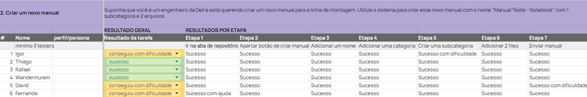

# WAD - Web Application Document - Módulo 2 - Inteli

## lLedTech

#### Nomes dos integrantes do grupo

- Gabriela Silva
- João Simão
- Lucas Nepomuceno
- Pietra Batista
- Tiago Santos
- Vinicius Savian

## Sumário

[1. Introdução](#c1)

[2. Visão Geral da Aplicação Web](#c2)

[3. Projeto Técnico da Aplicação Web](#c3)

[4. Desenvolvimento da Aplicação Web](#c4)

[5. Testes da Aplicação Web](#c5)

[6. Conclusões e trabalhos futuros](#c6)

[7. Referências](#c7)

[Anexos](#c8)

<br>

# <a name="c1"></a>1. Introdução


# <a name="c1"></a>1. Introdução 

&nbsp;&nbsp;&nbsp;&nbsp; 

A Dell trouxe a problemática de facilitar o acesso dos montadores das linhas de montagem aos materiais de estudo sobre os processos de montagem de seus aparelhos e, além disso, um meio para que os administradores pudessem organizar a publicação dos manuais, suas atualizações e o desempenho da equipe.

&nbsp;&nbsp;&nbsp;&nbsp;
Para resolver esse desafio, um site dedicado ao armazenamento, organização e compartilhamento de manuais será desenvolvido, fornecendo acesso fácil e rápido aos montadores. A solução oferece uma interface intuitiva, organizada por categorias e tópicos relevantes, permitindo que os usuários encontrem rapidamente os recursos de que precisam.

&nbsp;&nbsp;&nbsp;&nbsp;
Os aspectos essenciais para a criação de valor do produto incluem centralização de recursos, facilidade de acesso, padronização de processos, eficiência operacional e suporte à globalização.
Essa solução foi projetada para atender às necessidades específicas da Dell, ajudando a empresa a otimizar seus processos de produção e garantir a qualidade e consistência de seus produtos.

# <a name="c2"></a>2. Visão Geral da Aplicação Web 

## 2.1. Escopo do Projeto 


### 2.1.1. Contexto da indústria

&nbsp;&nbsp;&nbsp;&nbsp;
A Dell é uma empresa renomada no setor de tecnologia da informação, com uma forte presença global. Fundada em 1984 por Michael Dell, a empresa rapidamente se tornou uma das líderes mundiais na fabricação e venda de computadores, laptops, servidores e outros dispositivos eletrônicos.

&nbsp;&nbsp;&nbsp;&nbsp;
O segmento de atuação da Dell está inserido na indústria de tecnologia e informática, abrangendo desde o design e fabricação de hardware até a prestação de serviços de consultoria em tecnologia e suporte técnico. Suas atividades englobam a produção de uma ampla gama de produtos eletrônicos, como computadores pessoais, servidores empresariais, dispositivos de armazenamento e acessórios relacionados. Atualmente, seus principais concorrentes de mercado são: Lenovo, intel, asus, hp, etc.

&nbsp;&nbsp;&nbsp;&nbsp;
Com uma presença global significativa, a Dell opera em diversos países ao redor do mundo, atendendo a uma ampla variedade de clientes, desde consumidores individuais até grandes empresas e organizações governamentais.

### 2.1.2. Modelo de 5 Forças de Porter 

&nbsp;&nbsp;&nbsp;&nbsp;O modelo das 5 forças de Porter é uma ferramenta utilizada para realizar a análise de mercado. Por meio dela, é possível saber o que está acontecendo em determinado setor, assim como entender a dinâmica e a atuação da empresa no mercado, já que cada uma das cinco forças possui uma relação clara, direta e previsível com a lucratividade do setor.

&nbsp;&nbsp;&nbsp;&nbsp;As 5 forças de Porter são: a intensidade da rivalidade entre os competidores existentes, o poder de negociação dos compradores (os clientes do setor), o poder de negociação dos fornecedores, a ameaça dos substitutos e a ameaça de novos entrantes.

<div align="center">
<sub> Figura 1 - Modelo de 5 forças de Porter </sub>


<sup>Fonte: Material produzido pelos autores (2024)</sup>

</div>
<br>

#### Poder de Negociação dos Fornecedores:

&nbsp;&nbsp;&nbsp;&nbsp;A Dell é uma empresa consolidada no mercado global de tecnologia e isso gera uma vantagem na realização das negociações que é conquistada, principalmente, pelo volume de produtos produzidos mensalmente. Além disso, como alguns dos componentes para montagem costumam ser padronizados, eles podem ser substituídos por de outros fornecedores, mas, ainda assim, algumas peças são produzidas por poucas empresas no mercado tornando-as escassas para compra, fazendo com que o poder de barganha dos fornecedores mantenha-se como moderado, podendo variar de acordo com cada peça e seu mercado de produção.

#### Poder de Negociação dos Clientes:

&nbsp;&nbsp;&nbsp;&nbsp;Na atualidade, o mercado das montadoras de computadores e produtos de tecnologia para o público geral é muito competitivo. Isso porque, o consumidor desses produtos tem diversas opções de marcas que utilizam configurações semelhantes em seus produtos tecnológicos. Nesse contexto, o cliente final apresenta alto poder de negociação, dado que, em um mercado de alta competitividade e pouca diferenciação de especificações, a oferta se torna extremamente sensível à preços pouco competitivos.

#### Ameaça de Novos Entrantes:

&nbsp;&nbsp;&nbsp;&nbsp;Tendo em vista o alto nível de investimento necessário para o desenvolvimento de tecnologias e produção em larga escala, a ameaça de novos entrantes é moderada-baixa. Isso se dá pelo fato que, mesmo que o investimento inicial seja considerável, ainda existem exemplos como as gigantes chinesas Xiaomi e Huawei que permeiam o mercado tecnológico e produzem equipamentos de alta performance em preços competitivos. Todavia, ainda nesse cenário, não é possível considerar empresas como Xiaomi e Huawei como ameaças iminentes, uma vez que outra barreira prevalente é o prestígio da marca, tempo de mercado e visibilidade.

#### Ameaça de Produtos Substitutos:

&nbsp;&nbsp;&nbsp;&nbsp;A ameaça de produtos substitutos para computadores, notebooks e periféricos é baixa, pois, apesar de hoje existir uma grande diversidade de celulares e tablets, as pessoas não costumam abandonar os outros produtos, seja pelo desempenho que é disponibilizado em máquinas como notebook e computador e que não é possível encontrar em outros aparelhos, ou pelo fato de você possuir programas e softwares que são disponibilizados somente para esses dispositivos.

#### Rivalidade entre os Concorrentes Existentes:

&nbsp;&nbsp;&nbsp;&nbsp;A rivalidade entre os concorrentes existentes é alta, pelo fato que você possui diversos concorrentes no mercado que produzem produtos semelhantes como processadores, memória RAM, quantidade de armazenamento e outras características semelhantes ou iguais. Porém, o que leva uma empresa a se destacar mais que as outras é o valor agregado que ela entrega no seu produto com novos recursos, como sensor de digitais para desbloqueio dos notebooks, além da qualidade geral dos dispositivos, como a qualidade da carcaça, tela e de outras peças, ou a preferência pela marca que alguns clientes possuem pelo fato de ser uma marca reconhecida no mercado.

&nbsp;&nbsp;&nbsp;&nbsp;Com a análise das 5 forças de Porter, é possível concluir que o mercado em que a Dell está inserida é caracterizado pela competição intensa e pela busca por lucro por meio de vantagens competitivas, como desenvolver inovações que agregam valor ao seu produto final. Porém, por se tratar de um mercado tão competitivo, algumas empresas que vão surgindo com propostas diferentes possuem o investimento inicial como uma grande barreira de entrada, facilitando a gestão da permanência das grandes empresas como líderes desse ramo.


### 2.1.3. Análise SWOT 

&nbsp;&nbsp;&nbsp;&nbsp;A análise SWOT é uma ferramenta de gestão que examina os pontos fortes, fracos, ameaças  e  oportunidades do cenário em que uma empresa ou produto está inserida (FIA, 2023). A ênfase na análise interna ressalta cada um dos pontos fortes e fracos que fazem a empresa se destacar ou quaisquer problemas ou questões internas que possam atrapalhar o desenvolvimento do projeto, respectivamente. Para analisar fatores externos a um projeto ou empresa, a análise deve ser voltada para as ameaças, que são elementos ou situações que criam um ambiente desconfortável para a empresa, além das oportunidades, que são momentos em que a empresa pode explorar estrategicamente o mercado.


<div align="center">
<sub> Figura 2 - Matriz Swot </sub>
  


<sup>Fonte: Material produzido pelos autores (2024)</sup>

</div>
<br>

#### Forças:

1. Customização do produto: A capacidade de personalizar produtos conforme as necessidades dos clientes confere à Dell uma vantagem competitiva, permitindo atender a uma ampla gama de demandas e preferências do mercado.

2. Venda direta para o cliente: Eliminar intermediários permite à Dell manter maior controle sobre o processo de vendas, garantindo maior eficiência, margens de lucro e uma comunicação mais direta com os clientes.

3. Relacionamento sólido com o cliente: A construção de relacionamentos duradouros com os clientes fortalece a fidelidade à marca, aumenta a repetição de negócios e proporciona insights valiosos para melhorar os produtos e serviços.

4. Operações e cadeias de suprimentos simplificadas: Processos operacionais simplificados e uma cadeia de suprimentos eficiente podem resultar em redução de custos, maior agilidade e melhorias na qualidade do produto.

#### Fraquezas:

1. Dependência do hardware: A dependência excessiva do hardware pode limitar a flexibilidade da empresa para se adaptar a mudanças no mercado e no ambiente tecnológico.

2. Produtos de commodities: A natureza dos produtos como commodities pode levar a uma competição acirrada baseada principalmente em preço, reduzindo as margens de lucro e a diferenciação da marca.

3. Déficit de planejamento nos treinamentos: A falta de planejamento adequado nos treinamentos pode resultar em lacunas de habilidades entre os funcionários, afetando a eficiência operacional e a qualidade do serviço ao cliente.

4. Transição de funcionários entre áreas de montagem: A transição frequente de funcionários entre áreas de montagem pode causar interrupções na produção, aumentar os custos de treinamento e diminuir a consistência da qualidade.

5. Dependência de fornecedores: A dependência de fornecedores pode expor a Dell a vários riscos, incluindo interrupções na cadeia de suprimentos, flutuações nos preços das matérias-primas e falta de controle sobre a qualidade e disponibilidade dos componentes essenciais para a produção de seus produtos.

#### Oportunidades:

1. Expandir e fortalecer diferentes divisões de serviço: Aproveitar o crescimento e a demanda por serviços como IA, cibersegurança e computação em nuvem pode diversificar o portfólio da Dell, aumentar a receita e consolidar sua posição no mercado empresarial.

2. Investir em mercados emergentes: Entrar em mercados emergentes oferece à Dell a oportunidade de aumentar sua base de clientes, diversificar seu portfólio de produtos e explorar novas fontes de receita.

3. Evolução tecnológica: O avanço tecnológico oferece à Dell a oportunidade de desenvolver e lançar novos produtos e serviços inovadores, mantendo-se relevante e competitiva no mercado.

#### Ameaças:

1. Grande concorrência externa: A presença de concorrentes fortes como HP, Cisco e Fujitsu pode limitar a participação de mercado da Dell, aumentar a pressão sobre os preços e exigir um esforço adicional para diferenciar seus produtos e serviços.

2. Interrupções da cadeia de suprimentos por déficit de distribuição: Interrupções na cadeia de suprimentos podem levar a atrasos na produção, escassez de produtos e impactar negativamente a capacidade da Dell de atender à demanda do mercado.

3. Riscos com segurança cibernética: Com o aumento das ameaças cibernéticas, a Dell pode enfrentar o desafio de proteger seus produtos, dados e infraestrutura contra ataques, o que pode prejudicar sua reputação e resultar em perda de clientes e receita.

&nbsp;&nbsp;&nbsp;&nbsp;Ao aplicar a análise da matriz SWOT à Dell, fica claro que a empresa tem uma base sólida: uma marca forte com uma extensa rede de distribuição e um histórico comprovado de inovação tecnológica. No entanto, também enfrenta desafios como o aumento da concorrência e o rápido desenvolvimento da indústria tecnológica. Ao aproveitar os seus pontos fortes e capacidades ao mesmo tempo que aborda os pontos fracos e as ameaças com uma estratégia adaptativa e proativa, a Dell está bem posicionada para continuar a liderar o mercado tecnológico e fornecer soluções inovadoras para satisfazer as necessidades em constante mudança dos clientes.

### 2.1.4. Solução:

#### Problema a ser resolvido

&nbsp;&nbsp;&nbsp;&nbsp;A Dell enfrenta um problema na atualização dos seus montadores com relação aos manuais de montagem de seus produtos. Por conta da volatibilidade dos processos de montagem, faz-se necessário o constante treinamento dos seus colaboradores, perdendo tempo e dinheiro no caminho.

#### Dados disponíveis

&nbsp;&nbsp;&nbsp;&nbsp;Na busca de entender mais a problemática, o grupo 5 encontrou o<a href='https://www.dell.com/pt-br/dt/corporate/social-impact/esg-resources/reports/fy23-esg-report.htm?hve=leia+o+relat%C3%B3rio#pdf-overlay=//www.delltechnologies.com/asset/pt-br/solutions/business-solutions/briefs-summaries/delltechnologies-fy23-esg-report.pdf'> Relatório de ESG para o ano fiscal de 2023 distribuído pela Dell</a> mostrando seus resultados e métricas de sucesso. No documento, encontra-se a informação de que 13.296 horas foram investidas no treinamento interno nas fábricas.

#### Solução proposta

&nbsp;&nbsp;&nbsp;&nbsp;
O grupo 5 propõe, então, uma aplicação web que servirá como repositório dos manuais citados. Um site intuitivo, dedicado ao funcionário da Dell, em que o colaborador poderá se manter atualizado dos processos de sua linha de montagem, reduzindo o tempo investido na capacitação dos operadores.

#### Utilização da solução

&nbsp;&nbsp;&nbsp;&nbsp;A solução deve, então, ser usada pelos funcionários sempre que houver uma nova demanda da equipe de gestão. Na atualização dos manuais, as equipes que trabalham com o processo modificado devem receber acesso ao treinamento e se dedicar à leitura das alterações.

#### Benefícios da solução

&nbsp;&nbsp;&nbsp;&nbsp;Ao utilizar a plataforma proposta, a Dell combaterá um problema grave em uma linha produtiva tão extensa: a perda de tempo. Em uma empresa do porte da Dell Tecnologies, a eficiência nos processos internos é uma prioridade. Assim, um repositório dos manuais com a possibilidade de determinar leituras aos operários reduzirá o tempo necessário para manter a linha produtiva operando em seu máximo. Além de facilitar o treinamento de novos operários e agilizar a transição de colaboradores de uma linha para outra.

#### Critérios de sucesso

&nbsp;&nbsp;&nbsp;&nbsp;Para avaliar o sucesso da aplicação, duas métricas serão avaliadas: A avaliação dos usuários de teste sobre o quanto a página web é intuitiva para o aprendizado e o tempo investido na capacitação de um colaborador com a aplicação. O objetivo do grupo é agilizar o processo com algo que leve o colaborador a investir seu tempo da maneira mais eficiente possível no armazenamento dos manuais e gerenciamento da equipe, além de dar suporte aos montadores com a organização de seus manuais e suas atualizações.


### 2.1.5. Proposta de Valor 

&nbsp;&nbsp;&nbsp;&nbsp;A proposta de valor de um negócio define o serviço que está sendo oferecido e o motivo pelo qual ele é valioso para os potenciais clientes (PlayStudio, 2023). Para criar uma proposta de valor eficaz, é utilizado o Canvas Proposta de Valor, uma ferramenta de análise do consumidor que explora suas dores, necessidades e desejos, auxiliando na criação de uma solução de alto valor que esteja alinhada com o perfil do cliente (TeraBlog, 2023). Essa técnica permite aos empreendedores visualizar e entender o valor do produto que está sendo oferecido, orientando nas tomadas de decisões e proporcionando fundamento para novos lançamentos de produtos e serviços, ao investigar as tarefas que o cliente realiza hoje sem a solução, as dores que ele enfrenta ao tentar concluir tais tarefas e os ganhos que aspiram. Com base na análise do perfil do cliente, é possível desenvolver uma proposta de valor de negócio que supra as necessidades, curando as dores e potencializando os ganhos e desejos(Strategyzer, 2023).

&nbsp;&nbsp;&nbsp;&nbsp; Ao analisarmos o perfil da Dell, entendemos que existe uma ineficiência nos treinamentos dos operadores da fábrica. A partir disso, surgiu a oportunidade de desenvolver uma aplicação web de treinamento e monitoramento para os funcionários e gestores que divulga e disponibiliza materiais de instrução sobre os processos de montagem dos produtos da empresa. Desse modo, a equipe chegou à seguinte proposta de valor:

<div align="center">
<sub> Figura 3 - Canvas Proposta de Valor </sub>
  


<sup>Fonte: Material produzido pelos autores (2024)</sup>

</div>
<br>

&nbsp;&nbsp;&nbsp;&nbsp;A partir desse Canvas, foi possível explorar as dores e desejos do nosso cliente. Compreende-se que as dores consistem na desorganização da atual plataforma que utilizam e na perda de tempo com os treinamentos. Com a solução desenvolvida, ou seja, um site personalizado e organizado que não só disponibiliza todos os manuais de montagem para os funcionários, mas também garante que cada operador saiba os manuais obrigatórios que deve ler, a eficiência das linhas de produção aumenta e, por consequência, o tempo dos treinamentos é otimizado. A plataforma também concede aos gestores um maior controle sobre todo o conteúdo do site e a autoridade de editar, atualizar e delegar os manuais aos funcionários, além de monitorar o progresso de cada operador. Com um treinamento inteiramente digital e materiais que são constantemente atualizados, é descartada a necessidade de uma orientação presencial, criando os ganhos necessários para a satisfação do cliente. Dessa forma, foi criada uma aplicação que alivia as dores da Dell e cria ganhos, tornando-se uma solução eficaz e valiosa.

### 2.1.6. Matriz de Riscos 

&nbsp;&nbsp;&nbsp;&nbsp; Riscos são eventos ou circunstâncias incertas, cujas causas já ocorreram, e que, caso aconteçam, afetarão negativa ou positivamente o empreendimento do projeto (NAPOLEÃO, 2019; TOMAZ et al., 2020). Além disso, eles são inerentes a qualquer projeto e são orgânicos, ou seja, se tornam conhecidos e se modificam ao longo dos ciclos de desenvolvimento (TOMAZ et al., 2020). Por essas razões, é necessário um bom processo de gerenciamento de riscos composto pela identificação, priorização e controle iterativo dos riscos ao longo do desenvolvimento e planejamento do projeto (TOMAZ et al., 2020). O quadro abaixo, elaborado pela equipe em relação ao projeto para a Dell, representa o primeiro passo nesse gerenciamento: a Identificação de Riscos. <br>

<div align="center">
<sub>Quadro 1 - Identificação de Riscos Negativos</sub>

| \#  | Risco                                                  | Tipo de Risco                    |
| --- | ------------------------------------------------------ | -------------------------------- |
| 1   | Baixa performance do MVP na apresentação               | Desempenho, qualidade ou técnico |
| 2   | Entrega incompleta                                     | Gerenciamento de projetos        |
| 3   | Falta de alinhamento de expectativas com o cliente     | Organização                      |

<sup>Fonte: Material produzido pelos autores (2024)</sup>

</div>
<br>

&nbsp;&nbsp;&nbsp;&nbsp; O quadro acima foi elaborado a partir do atual estágio de aprendizagem da equipe. Sua organização é feita com base apenas na ordem alfabética dos riscos e a tipificação do risco foi estabelecida com base na categorização de riscos proposta por Tomaz et al (2020). Evidencia-se, porém, que não se trata de uma análise exaustiva dos riscos do projeto, dado a natureza orgânica dos riscos, mas de um demonstrativo do estágio atual do projeto. Observa-se, por exemplo, que a maioria dos riscos atualmente diz respeito à qualidade do produto final e a entrega do MVP, o que corresponde ao estágio atual do projeto que é o final do desenvolvimento.
<br>
&nbsp;&nbsp;&nbsp;&nbsp; Após a identificação dos riscos, é necessário avaliar a probabilidade e o impacto dos riscos visando a priorização no controle de riscos (TOMAZ et al. 2020). Para tanto, a equipe se utilizou da Análise Qualitativa em forma de Matriz de Riscos. Esta, trata-se de uma ferramenta de priorização de riscos que permite de forma visual identificar quais são os riscos que devem receber mais atenção (NAPOLEÃO, 2019). Para tanto, utiliza-se de uma matriz 2x2 com dois parâmetros: Impacto e Probabilidade dos riscos (NAPOLEÃO, 2019). No caso deste projeto, a probabilidade fora dividida em porcentagem (10%, 30%, 50%, 70%, 90%) e o impacto fora dividido qualitativamente (Muito baixo, Baixo, Moderado, Alto, Muito Alto). Subsequentemente, atribui-se à cada célula da matriz uma cor (verde, amarelo e vermelho) a depender da classificação do risco (baixo, moderado e alto, respectivamente) (NAPOLEÃO, 2019). Este foi o modelo utilizado para elaborar a Análise Qualitativa que se segue dos riscos apresentados no Quadro 1. <br>

<div align="center">
<sub> Figura 4 - Matriz de Riscos </sub>
  


<sup>Fonte: Material produzido pelos autores (2024)</sup>

</div>
<br>

&nbsp;&nbsp;&nbsp;&nbsp; A partir da figura acima, é possível verificar que todos os riscos apresentados possuem uma baixa probabilidade de acontecer, trazendo a devida segurança que o estágio atual de desenvolvimento do projeto pede. Entretanto, não se pode negligenciar o fato de que a todos os riscos listados estão classificados entre o impacto moderado, alto e muito alto. Portanto, um plano de ação detalhado visando o controle dos riscos, como o que se segue, torna-se necessário. <br>

<div align="center">
<sub>Quadro 2 - Plano de Ação: Riscos Negativos</sub>


| Risco                                                  | Prioridade | Plano de Ação                                                                                                                                                                                                                                                        |
| ------------------------------------------------------ | ---------- | -------------------------------------------------------------------------------------------------------------------------------------------------------------------------------------------------------------------------------------------------------------------- |
| Baixa performance do MVP durante a apresentação                              | Alta       | 1. Gravar um vídeo demonstrando o funcionamento da aplicação web; <br> 2. Abrir a aplicação web em mais de uma máquina na hora da apresentação; <br> 3. Preparar recursos chaves, como imagens do protótipo de alta fidelidade na apresentação caso a aplicação web pare de funcionar.
| Entrega Incompleta                                                          |  Média      | 1. Passar por todas as exigências dos artefatos novamente para garantir a cobertura de todas; <br> 2. Acompanhar o desenvolvimento das atividades da equipe por meio do KanBan e mantê-lo atualizado; <br> 3.Conferir a entrega com toda a equipe presente
| Falta de alinhamento de expectativas com o cliente                          | Alta       | 1. Garantir qur tudo que foi falado ou prometido durante apresentações seja entregue na sprint final; <br> 2. Ler novamente os feedbacks fornecidos pelos parceiros nas sprints passadas; <br> 3. Em caso de dúvidas ou incertezas, questionar para o parceiro e tentar chegar em um acordo.

<sup>Fonte: Material produzido pelos autores (2024)</sup>

</div>
<br>

&nbsp;&nbsp;&nbsp;&nbsp; O quadro acima fora elaborado pela equipe visando a mitigação dos riscos identificados e classificados anteriormente. Deve-se notar que para fins de simplificação, ele fora organizado em ordem alfabética assim como a tabela de Identificação de Riscos. Entretanto, a Matriz de Riscos apresentada na Figura 4 e a coluna de Prioridade, incorporam ao quadro o aspecto da eficiência, demonstrando quais riscos devem ser priorizados. <br>
&nbsp;&nbsp;&nbsp;&nbsp; Além dos processos acima, elaborados visando o controle dos riscos negativos do projeto, é importante não negligenciar o Gerenciamento de Oportunidades conforme apresentado pela ISO 9001 (RAMOS, 2019). Este, possui os mesmos passos iterativos do Gerenciamento de Riscos: identificar, priorizar e controlar; exceto pelo seu objeto que são riscos positivos (RAMOS, 2019). Portanto, segue a identificação dos riscos positivos pela equipe para esse projeto com a Dell:

<div align="center">
<sub>Quadro 3 - Identificação de Riscos Positivos</sub> <br>

| \#  | Risco                                                           |
| --- | --------------------------------------------------------------- |
| 1   | Ajudar na implementação da ferramenta na fábrica                |
| 2   | Atrair mais projetos de aplicação web para o Inteli             |
| 3   | Escalar a ferramenta para as fábricas da Dell em outras regiões |
| 4   | Licenciar a aplicação                                           |
| 5   | Receber propostas de estágios na Dell                           |

<sup>Fonte: Material produzido pelos autores (2024)</sup>

</div>
<br>

&nbsp;&nbsp;&nbsp;&nbsp; O quadro acima fora elaborado em ordem alfabética a partir da análise atual da equipe em relação às oportunidades do projeto. Assim como o Quadro 3, este não deve ser tomado como finalizado, dado a natureza orgânica dos riscos. Além disso, evidencia-se que diferente do primeiro, excluiu-se a tipificação dos riscos por Tomaz et al (2020) por esta não se aplicar a riscos positivos. <br>
&nbsp;&nbsp;&nbsp;&nbsp; Em correspondência aos passos do gerenciamento de oportunidades e riscos, elabora-se a avaliação qualitativa. De forma semelhante, utilizou-se da Matriz de Oportunidades apresentada por Tomaz et al (2020) e Napoleão (2019), a qual possui a mesma representação visual da matriz de risco. Entretanto, evidencia-se que, desta vez, a classificação dos riscos positivos em cores correspondem à sua capacidade de melhorar o projeto, sendo que verde é baixa, amarelo, moderada, e vermelho, alta. Segue-se, portanto, a Matriz de Oportunidades elaborada pela equipe nesta iteração: <br>

<div align="center">
<sub> Figura 5 - Matriz de Oportunidades</sub>
  


<sup>Fonte: Material produzido pelos autores (2024)</sup>

</div>
<br>

&nbsp;&nbsp;&nbsp;&nbsp; A partir da figura acima, é possível observar que a maioria das oportunidades se encontram na metade inferior da matriz. Isso corrobora o estágio atual do projeto e espera-se que ao decorrer deste e a elaboração e implementação do plano de ação, essa situação se inverta. Desta forma, os membros da equipe poderão aproveitar e ampliar o impacto do projeto nas suas vidas e de seus clientes (RAMOS, 2019) <br>
&nbsp;&nbsp;&nbsp;&nbsp; Entretanto, isso só é possível a partir da criação de um plano de ação que aborde estratégias ótimas de controle de oportunidades. Ramos (2019) apresenta as estratégias Explorar; Melhorar; Compartilhar ou Aceitar com base no grau da ação que será tomada em prol de uma oportunidade. Já Napoleão (2019), apresenta, com base na classificação da oportunidade, as seguintes possíveis estratégias: <br>

- Baixa: Se forem de baixo impacto, esquecer; se forem de alto impacto, atue sobre elas
- Moderada: Crie uma rotina de monitoramento
- Alta: Planeje ações para essas oportunidades

&nbsp;&nbsp;&nbsp;&nbsp;Com base nesses autores, a equipe elaborou o seguinte plano de ação: <br>

<div align="center">
<sub>Quadro 4 - Plano de Ação: Riscos Positivos</sub>


| Risco                                                           | Estratégia   | Plano de Ação                                                                                                                                                                                                                                                                                                                                                                         |
| --------------------------------------------------------------- | ------------ | ------------------------------------------------------------------------------------------------------------------------------------------------------------------------------------------------------------------------------------------------------------------------------------------------------------------------------------------------------------------------------------- |
| Ajudar na implementação da ferramenta na fábrica                | Aceitar      | Nenhuma ação.                                                                                                                                                                                                                                                                                                                                                                         |
| Atrair mais projetos de aplicação web para o Inteli             | Compartilhar | 1. Criar uma documentação que se alinhe com as expectativas do Escritório de Projetos do Inteli; <br> 2. Compartilhar a evolução do projeto no Linkedin; <br> 3. Participar de entrevistas organizadas pela equipe de marketing do Inteli.                                                                                                                                            |
| Escalar a ferramenta para as fábricas da Dell em outras regiões | Explorar     | 1. Analisar periodicamente os requerimentos do projeto; <br> 2. Melhorar a responsividade da aplicação com o uso do CSS; <br> 3. Testar a performance do projeto periodicamente com o uso da ferramenta LightHouse do Google; <br> 4. Documentar extensivamente as sprints do projeto; <br> 5. Validar os padrões de qualidade da aplicação com os clientes, monitores e professores. |
| Licenciar a aplicação                                           | Compartilhar | 1. Criar uma documentação que se alinhe com as expectativas do Escritório de Projetos do Inteli; <br> 2. Realizar testes de usabilidade do produto final; <br> 3. Pesquisar acerca do processo de licenciamento de aplicação.                                                                                                                                                         |

<sup>Fonte: Material produzido pelos autores (2024)</sup>

</div>
<br>

&nbsp;&nbsp;&nbsp;&nbsp; A partir do quadro acima, é possível analisar que nem todos os riscos positivos estão totalmente sob o controle da equipe. Por essa razão, a maioria se enquadra nas estratégias “Aceitar” e “Compartilhar”, as quais dependem da ação de outros atores, como o Escritórios de Projetos, para se concretizarem. Entretanto, espera-se que a efetivação do plano e a adequação da aplicação aos padrões de qualidade Inteli auxiliem no convencimento desses atores. <br>
&nbsp;&nbsp;&nbsp;&nbsp; Conclui-se que essa seção fora necessária à análise do Escopo do Projeto por incorporar as ferramentas de Gerenciamento de Riscos e Oportunidades. Ela foi elaborada com base nos trabalhos de três autores e é de vital importância para a identificação, priorização e controle dos riscos reais e potenciais do projeto, indicando para cada um deles: i. Impacto e probabilidade ii. Plano de ação e resposta para todos os riscos. Portanto, auxiliará a equipe e os leitores do projeto a controlar possíveis circunstâncias ou eventos que podem afetar negativa ou positivamente o empreendimento deste projeto no futuro. <br>


## 2.2. Personas 

&nbsp;&nbsp;&nbsp;&nbsp;Segundo o Grupo Nielsen Norman, as personas apoiam para que haja um desenvolvimento de solução centrado no usuário, permitindo que a solução atenda a todas as necessidades e expectativas do usuário. A descrição das personas deve ser completa  incluindo detalhes sobre as necessidades, preocupações e objetivos da persona, bem como informações básicas como idade, sexo, comportamentos e ocupação. Pensando nisso, 2 personas que representam os principais usuários da solução foram desenvolvidas: O Engenheiro e o Montador.

<div align="center">

<sup>Figura 6 - Persona Engenheiro </sup>


<sub>Fonte: Material Produzido pelos autores (2024)</sub>

<sup>Figura 7 - Persona Montador</sup>


<sub>Fonte: Material Produzido pelos autores (2024)</sub>

</div>

&nbsp;&nbsp;&nbsp;&nbsp;Essas personas foram desenvolvidas de acordo com os requisitos e objetivos do projeto, além de representarem os principais usuários que irão utilizar a solução desenvolvida. Sendo assim, ao desenvolver personas alinhadas ao público real, garantimos que o projeto atenda às expectativas e agregue valor à empresa.


## 2.3. User Stories 

&nbsp;&nbsp;&nbsp;&nbsp; Segundo DOMINGO(2021), <i> user stories </i> são como frases curtas orientadas para melhorar a experiência do usuário com um produto. Estas são usadas para guiar os times de metodologia ágil e devem seguir o seguinte modelo: Eu, [como X], quero [Y] para [Z]. Além disso, para aumentar o potencial das <i> user stories </i>, espera-se que estas sejam associadas à alguma persona elaborada para o projeto e à critérios de aceite que terão testes próprios de aceitação. Isso permite que as *user stories* sejam validadas, concedendo-as maior relevância. Durante esse projeto, as <i> user stories </i> foram atualizadas conforme a passagem das sprints e as que seguem são suas versões mais recentes. 

<div align="center" >

<sub>Quadro 5 - User Stories 001</sub>
Identificação | US001
--- | ---
Persona | Michele
User Story | Eu, enquanto montadora, quero poder acessar todos os manuais que me delegaram para que eu possa me atualizar acerca do processo que estou envolvida na linha.
Critérios de aceite 1 | O montador recebe somente os manuais que foram delegados para ele.
Teste de Aceitação | O montador entra na sua página de KanBan. <br> T01A: Todos os manuais do montador estão presentes e nenhum manual de outro montador está presente. <br> T01B: Algum dos manuais delegados não está presente ou manuais delegados para outros funcionários estão presentes. Errado, precisa ser corrigido.
Critério de aceite 2 | O montador acessa as páginas de arquivos de um manual.
Teste de Aceitação | O montador clicou no manual. <br> T02A: Abre uma página com os arquivos do manual desejado. <br> T02B: Nenhuma página é aberta ou carregada. Errado, precisa ser corrigido.
Critério de aceite 3 | O montador acessa um arquivo dentro do manual.
Teste de Aceitação | O montador aperta no arquivo do manual. <br> T03A: O montador é redirecionado para uma nova página com o conteúdo do arquivo. <br> T03B: Nenhuma página é aberta ou carregada ou o conteúdo não corresponde com o arquivo desejado. Errado, precisa ser corrigido.


<sup>Fonte: material produzido pelos autores (2024)</sup>

<sub>Quadro 6 - User Stories 002</sub>
Identificação | US002
--- | ---
Persona | Michele
User Story | Eu, enquanto montadora, quero poder checar os manuais que fiz para que os engenheiros saibam que estou a par das novas atualizações.
Critério de aceite 1 | A montadora pode checar um arquivo do manual.
Teste de Aceitação | A montadora abre um arquivo do manual pela primeira vez. <br> T01A: Um botão funcional de checkbox aparece ao lado do arquivo. <br> T01B: Nenhum botão de checkbox aparece. Errado, precisa ser corrigido.
Critério de aceite 2 | A montadora finaliza um manual com sucesso.
Teste de Aceitação | A montadora aperta o botão de finalizar manual. <br> T03A: O manual é movido para a coluna "Feito" no KanBan e registrado como lido no banco de dados.<br> T03B: O manual não é movido no Kanban e/ou não é registrado como lido no sistema. Errado, precisa ser corrigido.


<sup>Fonte: material produzido pelos autores (2024)</sup>

<sub>Quadro 7 - User Stories 003</sub>
Identificação | US003
--- | ---
Persona | Rodrigo
User Story | Eu, enquanto engenheiro da linha de montagem, quero delegar manuais específicos para os montadores da fábrica para que eles se mantenham atualizados acerca do processo da linha de montagem.
Critérios de aceite 1 | O engenheiro pode selecionar um manual entre os cadastrados no sistema.
Teste de Aceitação | O engenheiro entra na página de delegação. <br> T01A: Há um *dropdown* de "selecionar manual" com todos os manuais cadastrados na plataforma. <br> T01B: Não há um *dropdown* de selecionar manual ou algum manual cadastrado não está presente. Errado, precisa ser corrigido.
Critério de aceite 2 |  O engenheiro pode selecionar um montador entre os cadastrados no sistema.
Teste de Aceitação | O engenheiro entra na página de delegação. <br> T02A: O engenheiro pode pesquisar e checar os montadores que ele deseja. <br> T02B: O engenheiro não consegue pesquisar um funcionário e/ou não consegue checar os montadores que ele deseja. Errado, precisa ser corrigido.
Critério de aceite 3 | O engenheiro pode delegar uma tarefa a um funcionário.
Teste de Aceitação | O engenheiro clica no botão "Criar Tarefa" na página de delegação, tendo selecionado o manual e, pelo menos, um funcionário. <br> T03A: Para cada montador selecionado, uma inserção na tabela <code> delegation </code> é feita com o respectivo manual selecionado. <br> T03B: As inserções não são feitas na tabela ou é preenchida incorretamente. Errado, precisa ser corrigido.

<sup>Fonte: material produzido pelos autores (2024)</sup>

<sub>Quadro 8 - User Stories 004</sub>
Identificação | US004
--- | ---
Persona | Rodrigo
User Story | Eu, enquanto engenheiro da linha de montagem, quero conseguir acompanhar estátisticas de leitura dos montadores que tenham leituras delegadas para prevenir erros durante o processo de montagem.
Critérios de aceite 1 | As informações presentes na *dashboard* são relevantes.
Teste de Aceitação | O engenheiro acessa seu *dashboard*. <br> T01A: Há um gráfico que mostra o percentual de completude das leituras por parte dos montadores. <br> T01B: O gráfico não está presente ou mostra dados não correspondentes com a realidade. Errado, precisa ser corrigido.
Critérios de aceite 2 | Os gráficos da *dashboard* refletem as delegações feitas.
Teste de Aceitação |T02A:  Os gráficos na *dashboard* mostram o progresso de todas as delegações feitas até o momento. <br> T02B: Os gráficos na *dashboard* não mostram o progresso das delegações corretas ou estão desatualizados. Errado, precisa ser corrigido.

<sup>Fonte: material produzido pelos autores (2024)</sup>

<sub>Quadro 9 - User Stories 005</sub>
Identificação | US005
--- | ---
Persona | Rodrigo
User Story | Eu, enquanto engenheiro da linha de montagem, quero adicionar diferentes tipos de arquivos nos manuais para facilitar o aprendizado.
Critérios de aceite 1 | O engenheiro consegue adicionar arquivos aos manuais.
Teste de Aceitação | O engenheiro anexa um novo arquivo a um manual existente. <br> T01A: O arquivo é inserido com sucesso à tabela <code> files </code>. <br> T01B: O arquivo não é adicionado à tabela <code> files </code> ou foi incorretamente inserido. Errado, precisa ser corrigido
Critério de aceite 2 | A URL está funcional.
Teste de Aceitação | O engenheiro clica no manual para verificar o arquivo que adicionou. <br> T01B: O engenheiro consegue abrir o arquivo correto a partir do link externo presente no arquivo. <br> T02B: O arquivo não redireciona a um link externo ou o arquivo aberto não é o esperado. Errado, precisa ser corrigido

<sup>Fonte: material produzido pelos autores (2024)</sup>

<sub>Quadro 10 - User Stories 006</sub>
Identificação | US006
--- | ---
Persona | Rodrigo
User Story | Eu, enquanto engenheiro, quero uma tela de repositório para que eu possa ver e atualizar os manuais cadastrados no sistema.
Critérios de aceite 1 | O engenheiro consegue ver todos os manuais
Teste de Aceitação | O engenheiro aperta em manuais no seu painel de controle. <br> T01A: Aparece uma seção do site com todos os manuais cadastrados no sistema. <br> T02B: Não aparece uma seção de manuais ou algum manual cadastrado não aparece na seção. Errado, precisa ser corrigido.
Critério de aceite 2 | O engenheiro consegue pesquisar um manual.
Teste de Aceitação | O engenheiro aperta em manuais no seu painel de controle. <br> T02A: Aparece uma barra de pesquisa na qual ele pode inserir o nome do manual. <br> T01B: Não aparece uma barra de pesquisa ou ele não consegue inserir o nome do manual. Errado, precisa ser corrigido.

<sup>Fonte: material produzido pelos autores (2024)</sup>


<sub>Quadro 11 - User Stories 007</sub>
Identificação | US007
--- | ---
Persona | Michele
User Story | Eu, enquanto montadora, quero ter uma tela de visualização de manuais para que eu possa acessar os arquivos contidos em cada um deles.
Critérios de aceite 1 | A montadora é redirecionada a uma nova tela.
Teste de Aceitação | A montadora aperta no manual. <br> T01A: A montadora é redirecionada para uma nova tela contendo o título do manual clicado.<br> T01B: A montadora não é redirecionada ou a nova tela não contém o título do manual clicado. Errado, precisa ser corrigido.
Critério de aceite 2 | A montadora vê todos os arquivos que pertencem a um manual.
Teste de Aceitação | A montadora aperta no manual. <br> T02A: A tela para qual a montadora é redirecionada contém todos os arquivos da tabela <code> files </code> pertencentes ao manual clicado. <br> T02B: A tela para qual a montadora é redirecionada não contém algum arquivo da tabela <code> files </code> pertencentes ao manual clicado. Errado, precisa ser corrigido.
Critério de aceite 3 | A montadora é redirecionada à URL do arquivo.
Teste de Aceitação | A montadora clica em um dos arquivos da nova tela. <br> T03A: A montadora é redirecionada à URL correspondente àquele arquivo na tabela <code> files </code> <br> T03B: A montadora não é redirecionada ou à URL não corresponde à URL presente na tabela <code> files </code>. Errado, precisa ser corrigido.

<sup>Fonte: material produzido pelos autores (2024)</sup>

<sub>Quadro 12 - User Stories 008</sub>
Identificação | US008
--- | ---
Persona | Michele
User Story | Eu, enquanto montadora, quero ter uma tela de KanBan para que eu possa ver e manter um histórico das minhas leituras.
Critérios de aceite 1 | A montadora tem acesso à três colunas (A fazer, fazendo e feito).
Teste de Aceitação | A montadora entra no seu painel de controle. <br> T01A: Aparecem três colunas com os títulos: "A fazer", "Fazendo" e "Feito", nessa ordem. <br> T01B: Não aparece alguma ou nenhuma das três colunas ou a ordem das colunas não está correta. Errado, precisa ser corrigido.
Critério de aceite 2 | Os manuais não começados estão na coluna "A Fazer". 
Teste de Aceitação | A montadora entra no seu painel de controle. <br> T02A: Os manuais delegados mas não abertos estão na coluna "A Fazer". <br> T02B: Há manuais não delegados ou manuais já abertos e parcialmente checados na coluna "A Fazer". Errado, precisa ser corrigido.
Critério de aceite 3 | Os manuais começados estão na coluna "Fazendo".
Teste de Aceitação | A montadora entra no seu painel de controle. <br> T03A: Os manuais delegados e abertos estão na coluna "Fazendo". <br> T03B: Há manuais não delegados, não começados ou finalizados na coluna "fazendo". Errado, precisa ser corrigido.
Critério de aceite 4 | Os manuais finalizados estão na coluna "Feito".
Teste de Aceitação | A montadora entra no seu painel de controle. <br> T04A: Os manuais delegados e finalizados estão na coluna "Feito". <br> T04B: Há manuais não delegados ou não finalizados na coluna "Feito". Errado, precisa ser corrigido.

<sup>Fonte: material produzido pelos autores (2024)</sup>

<sub>Quadro 13 - User Stories 009</sub>
Identificação | US009
--- | ---
Persona | Rodrigo
User Story | Eu, enquanto engenheiro, quero ter uma tela de login onde posso inserir minhas credenciais e acessar telas personalizadas para mim.
Critérios de aceite 1 | O usuário pode inserir seu email institucional.
Teste de Aceitação | O usuário entra na tela de login. <br> T01A: Aparece um campo em que o usuário pode inserir um email. <br> T01B: Não aparece um campo em que o usuário pode inserir seu email. Errado, precisa ser corrigido.
Critério de aceite 2 | O usuário pode inserir sua senha.
Teste de Aceitação | O usuário entra na tela de login. <br> T02A: Aparece um campo em que o usuário pode inserir sua senha. <br> T02B: Não aparece um campo em que o usuário pode inserir sua senha. Errado, precisa ser corrigido
Critério de aceite 3 | Os dados do usuário são validados.
Teste de Aceitação | O usuário insere "email" e "senha" e tenta submeter o formulário. <br> T03A: É verificado se o email e senha está no banco de dados, e se não estão, aparece uma mensagem de erro. <br> T03B: Não é verificado se o email e senha estão no banco de dados ou se não estão, não aparece uma mensagem de erro.
Critério de aceite 4 | O usuário é redirecionado à seu respectivo *dashboard*.
Teste de Aceitação | O usuário foi validado na tela de login. <br> T04A: O engenheiro é redirecionado à seu *dashboard*. <br> T04B: O engenheiro não é redirecionado à seu *dashboard*. 

<sup>Fonte: material produzido pelos autores (2024)</sup>

<sub>Quadro 14 - User Stories 010</sub>
Identificação | US010
--- | ---
Persona | Michele
User Story | Eu, enquanto montadora, quero ter uma tela de login onde posso inserir minhas credenciais e acessar telas personalizadas para mim.
Critérios de aceite 1 | O usuário pode inserir seu email institucional.
Teste de Aceitação | O usuário entra na tela de login. <br> T01A: Aparece um campo em que o usuário pode inserir um email. <br> T01B: Não aparece um campo em que o usuário pode inserir seu email. Errado, precisa ser corrigido.
Critério de aceite 2 | O usuário pode inserir sua senha.
Teste de Aceitação | O usuário entra na tela de login. <br> T02A: Aparece um campo em que o usuário pode inserir sua senha. <br> T02B: Não aparece um campo em que o usuário pode inserir sua senha. Errado, precisa ser corrigido.
Critério de aceite 3 | Os dados do usuário são validados.
Teste de Aceitação | O usuário insere "email" e "senha" e tenta submeter o formulário. <br> T03A: É verificado se o email e senha estão no banco de dados, e se não estão, aparece uma mensagem de erro. <br> T03B: Não é verificado se o email e senha estão no banco de dados ou se não estão, não aparece uma mensagem de erro.
Critério de aceite 4 | O usuário é redirecionado à sua tela de Kanban.
Teste de Aceitação | O usuário foi validado na tela de login. <br> T04A: O montador é redirecionado ao seu KanBan. <br> T04B: O montador não é redirecionado ao seu KanBan.

<sup>Fonte: material produzido pelos autores (2024)</sup>

<sub>Quadro 15 - User Stories 011</sub>
Identificação | US011
--- | ---
Persona | Rodrigo
User Story | Eu, enquanto engenheiro da linha de montagem, quero conseguir criar novos manuais e adicionar os seus respectivos arquivos dentro para que eu consiga delegá-los para a equipe.
Critérios de aceite 1 | O engenheiro pode acessar a funcionalidade de criação de manuais.
Teste de Aceitação | T01A: O engenheiro clica na opção "Manuais", depois no botão "Criar Manual" e um formulário de criação é exibido.<br> T01B: A página de manuais não exibe o botão "Criar Manual" ou não carrega o formulário de criação . Errado, precisa ser corrigido.
Critério de aceite 2 | O engenheiro pode adicionar arquivos ao manual.
Teste de Aceitação | T02A: O engenheiro clica no ícone azul de confirmação e a URL do arquivo é adicionada no banco de dados na tabela <code>files</code> e relacionada ao próprio manual. <br> T02B: O ícone não adiciona a URL do arquivo no banco de dados e/ou não relaciona o arquivo ao manual. Errado, precisa ser corrigido.

<sup>Fonte: material produzido pelos autores (2024)</sup>

<sub>Quadro 16 - User Stories 012</sub>
Identificação | US012
--- | ---
Persona | Rodrigo
User Story | Eu, enquanto engenheiro da linha de montagem, quero conseguir atualizar os conteúdos de um manual já existente para que o sistema permaneça atualizado mesmo com as mudanças frequentes.
Critérios de aceite 1 | O engenheiro pode acessar e editar manuais existentes.
Teste de Aceitação |T01A: O engenheiro seleciona um manual existente e clica no ícone azul de edição, podendo modificar o conteúdo.<br> T01B:  O ícone não permite modificar o conteúdo do manual. Errado, precisa ser corrigido.

<sup>Fonte: material produzido pelos autores (2024)</sup>

<sub>Quadro 17 - User Stories 013</sub>
Identificação | US013
--- | ---
Persona | Rodrigo
User Story | Eu, enquanto engenheiro da linha de montagem, quero conseguir apagar manuais para que as delegações não sejam desatualizadas e para garantir o funcionamento das linhas de montagem.
Critérios de aceite 1 | O engenheiro pode acessar a funcionalidade de exclusão de manuais. 
Teste de Aceitação |T01A: O engenheiro, dentro da página de manuais, seleciona um manual e clica no ícone vermelho de exclusão, e o manual é removido do sistema.<br> T01B:  O ícone não remove o manual do sistema. Errado, precisa ser corrigido.

<sup>Fonte: material produzido pelos autores (2024)</sup>
</div>

&nbsp;&nbsp;&nbsp;&nbsp; A partir das tabelas acima, é possível observar as jornadas de usuário esperadas dentro do sistema da DellAware. Percebe-se a necessidade de desenvolver funcionalidades como adicionar um manual e ler um manual. Além disso, evidencia-se a necessidade de desenvolver telas como o *dashboard* do engenheiro e o KanBan do montador. O uso das <i> user stories </i> acima denotam a centralidade do usuário em nossa aplicação web, dado que essas são ligadas à personas específicas.

# <a name="c3"></a>3. Projeto da Aplicação Web 

## 3.1. Arquitetura 

&nbsp;&nbsp;&nbsp;&nbsp; Atualmente, o mercado demanda dos desenvolvedores web um alto padrão de complexidade (ALVES, 2015). Para tanto, é necessário que haja clara separação de funções entre os membros da equipe para a execução de tarefas e entre os componentes de uma aplicação web (ALVES, 2015). Por esse viés, se originou o paradigma de programação orientada à objetos, cujo um dos fundamentos é o encapsulamento e também a arquitetura MVC ("Model-View-Controller") (ALVES, 2015; HENRIQUE, 2023). Este último conceito será utilizado nessa aplicação. <br>
&nbsp;&nbsp;&nbsp;&nbsp; A arquitetura MVC é um padrão de design de software reconhecido mundialmente que divide a tarefa de acesso de dados e a apresentação de um aplicação web em três camadas distintas (COODESH, 2022; ALVES, 2015):

- Model: camada que se comunica diretamente com o banco de dados, armazenando e recuperando informações. Além disso, é a camada responsável pela lógica de negócios;
- View: camada que é responsável pela User Interface (UI), contendo os estilos CSS, os arquivos HTML e as rotinas em Javascript;
- Controller: camada que é responsável por responder as ações do usuário e age como intermediário entre o Model e a View. <br>

&nbsp;&nbsp;&nbsp;&nbsp; Optou-se por essa arquitetura de software para este projeto, construindo-se o diagrama que se segue: <br>

<div align="center">
<sub> Figura 8 - Diagrama de Arquitetura</sub>
  


<sup>Fonte: Material produzido pelos autores (2024)</sup>

</div>

&nbsp;&nbsp;&nbsp;&nbsp; Como se observa na figura acima, idealizou-se uma aplicação com cinco componentes na camada View, seis na camada Controller e cinco na camada Model. As relações entre essas camadas não serão extensivamente expostas nesse WAD, visando a objetividade da solução. Não obstante, o detalhamento do modelo pode ser acessado por meio do repositório a seguir: <a href="https://github.com/Lucas-nepomuceno/arquitetura-dellaware"> Repositório com detalhamento da arquitetura MVC </a> <br>
&nbsp;&nbsp;&nbsp;&nbsp; Neste projeto, utilizamos o software Render para hospedar nosso banco de dados criado em PostgreSQL, o Dbeaver como Sistema de Gerenciamento de Banco de Dados (SGBD), o Sails.js como framework, o Node.js como <i>runtime environment</i> e o HTML5 e CSS3 para a construção da UI. Essas tecnologias se relacionam à arquitetura MVC da seguinte forma:

- HTML5 e CSS3: View
- Sails.js: Controller/model
- Dbeaver: Model
- Render: Server
- Node.js: runtime environment

&nbsp;&nbsp;&nbsp;&nbsp; Isso foi feito levando em consideração as tecnologias disponibilizadas pela instituição e a trilha de aprendizagem do módulo. Preferiu-se, também, o uso de tecnologias "open source", como o Sails.js e o Node Js. Com relação ao impacto no projeto, a integração das tecnologias escolhidas à arquitetura MVC proporciona uma estrutura robusta para o projeto. O uso do framework Sails.js agiliza o desenvolvimento ao oferecer funcionalidades predefinidas para lidar com a lógica de negócios e interação com o banco de dados. Além disso, a adoção de tecnologias de código aberto reduz os custos e aumenta a flexibilidade do projeto, permitindo adaptações conforme necessário. Essas decisões combinadas promovem uma implementação eficiente e adaptável, alinhada às exigências do projeto e as habilidades da equipe.

## 3.2. Wireframes 

&nbsp;&nbsp;&nbsp;&nbsp; Wireframe é uma ferramenta de design comumente utilizada no desenvolvimento web (MIRO, 2023). Visa-se, com ela, esboçar telas iniciais de uma aplicação web, demonstrando o layout, a estrutura e as funcionalidades das páginas, além do user flow dentro da aplicação (GUIMARAES; EQUIPE AELA, 2019; MIRO, 2023). Tratando-se apenas de um esboço, não é esperado um relacionamento de alta fidelidade entre os wireframes e o MVP (GUIMARAES; EQUIPE AELA, 2019). Entretanto, o wireframe deve ser capaz de direcionar inicialmente a equipe de design e alinhar as expectativas do cliente (GUIMARAES; EQUIPE AELA, 2019). Para o DellAware, foi desenvolvido um wireframe único, cujo fluxo de usuários obriga-o a ser explicado em duas partes distintas: montador e administrador. <br>

&nbsp;&nbsp;&nbsp;&nbsp; Abaixo, é possível encontrar o wireframe idealizado para o montador. Ele é constituído de três telas e apresenta de forma simples, como a equipe imaginava dispor os elementos em cada uma dessas páginas. Ao observar a imagem abaixo, considere que o seguinte wireframe segue o épico principal do montador: "Eu, como montador, quero poder acessar manuais designados para mim e receber atualizações de quaisquer modificações desses manuais, deixando meu gerente a par do meu prograsso na leitura desses manuais".


<div align="center">
<sub> IMAGEM X - Wireframe do Montador</sub>
  


<sup>Fonte: Material produzido pelos autores (2024)</sup>

</div>
<br>

&nbsp;&nbsp;&nbsp;&nbsp; A partir da imagem acima, evidencia-se que a equipe imaginou as seguintes páginas no fluxo de usuário do montador:

1. Login
2. Kanban
3. Visualização do manual

&nbsp;&nbsp;&nbsp;&nbsp; Tentou-se, minimizando o número de páginas, um menor nível de atrito para que o montador visualizasse o manual com facilidade. Além disso, o uso do KanBan advém da familiariedade da equipe com a ferramenta. <br>

&nbsp;&nbsp;&nbsp;&nbsp; Após a reunião de validação com o cliente, modificou-se a interatitividade do Kanban e adicionou-se à tela de visualização de manual. O primeiro porque o Kanban não poderia seguir a sua interatitividade usual de "arrastar", dado contexto fabril do montador. Além disso, transformou-se em requisito, uma checagem final na última tela, a qual deve ser disponibilizada após a checagem de todos os materiais e arrastará automaticamente os itens no Kanban. <br>

&nbsp;&nbsp;&nbsp;&nbsp; Em relação ao wireframe do administrador, idealizou-se inicialmente 6 páginas que seguem o seguinte diagrama:

<div align="center">
<sub> FIGURA X - Diagrama de Fluxo Administrador</sub>
  


<sup>Fonte: Material produzido pelos autores (2024)</sup>

</div>
<br>

&nbsp;&nbsp;&nbsp;&nbsp; Conforme a imagem acima, imaginou-se três possíveis fluxos para o administrador, visando o seguinte épico: "Eu, como administrador, quero poder ver o desempenho da minha equipe em relação aos manuais que os delegarei e quero poder alterar os manuais no banco de dados". Este fluxo é representado pelo wireframe abaixo: <br>

<div align="center">
<sup> FIGURA X - Wireframe Administrador</sup>
  


<sub>Fonte: Material produzido pelos autores (2024)</sub>

</div>
<br>

&nbsp;&nbsp;&nbsp;&nbsp; A partir da imagem acima, observa-se que a equipe tentou denotar a importância das estatísticas dos funcionários no layout da dashboard, mas também tentou comprimir todos os requisitos a partir dessa mesma página. Isso ocorreu visando a otimização do atrito, conforme pedido do cliente. Além disso, abstrai-se do wireframe a estrutura que a lLedTech imaginou condizer com a fábrica: um engenheiro para uma equipe de funcionários. <br>
&nbsp;&nbsp;&nbsp;&nbsp; Entretanto, após a reunião de validação com o cliente, modificou-se o layout do dashboard e a estrutura da página de delegação. O primeiro, pois o cliente preferiu um espaço maior de 50% na página de dashboard para as estatística. O segundo, pois a estrutura da fábrica segue a cardinalidade N:N, de modo que optou-se por aumentar a quantidade de filtros para encontrar funcionários. <br>
&nbsp;&nbsp;&nbsp;&nbsp; Conclui-se, nesta seção, a idealização inicial da UI do projeto. Observa-se que pouco foi alterado em termos de estrutura, o que permite à equipe caminhar com maior segurança no projeto. Não obstante, todas as alterações foram devidamente documentadas e estarão presentes na seção 3.4 com o protótipo de alta fidelidade. Caso deseje, é possível acessar o wireframe e experienciar o user flow a partir do seguinte link: <a href="https://www.figma.com/design/mphCWxz1Ee7ABNooSCmWbO/Wireframe-de-baixa-fidelidade---Dell-(Copy)?node-id=0-1&t=DcOzjyT1dZkKo3AP-1"> Wireframe </a>

## 3.3. Guia de estilos 


&nbsp;&nbsp;&nbsp;&nbsp;O guia de estilos é um documento que estabelece as diretrizes de design de uma empresa, projeto, marca ou produto específico. Ele é essencial, pois proporciona consistência e uniformidade na comunicação visual. O guia de estilos garante que todas as interfaces do projeto tenham os mesmos elementos, padrão de cores, tipografia e iconografia (GUIMARÃES; EQUIPE AELA, 2021). Além disso, ele facilita o desenvolvimento de novas interfaces e protótipos, e promove uma comunicação mais eficaz entre os times de design e desenvolvimento. <br>

### 3.3.1 Cores

&nbsp;&nbsp;&nbsp;&nbsp;As cores escolhidas para uma aplicação Web são muito importantes. Elas ajudam a transmitir informação e guiar o usuário, além de estabelecer uma identidade visual impactante (AWARI, 2023). Ademais, deve-se realizar uma escolha assertiva para que se impulsione o impacto positivo que ela terá na experiência dos usuários que interagem com o site (AELA, 2020). <br>

<div align="center">
<sup> Figura 9 - Paleta de Cores</sup> <br>
	


<sub>Fonte: Material produzido pelos autores (2024)</sub>

</div>
<br>

&nbsp;&nbsp;&nbsp;&nbsp;A paleta de cores da aplicação foi definida com base no <a target='_blank' href='https://www.delldesignsystem.com/foundations/color/'><i>Design System Dell</i></a>, e escolheu-se como cor principal a Blue 600 (#0672CB), sendo a cor base para a maior parte dos itens da <i>User Interface (UI)</i>, e as cores <i>Blue 400 (#31A2E3), Blue 500 (#1282D6), Blue 700 (#0063B8) e Blue 800 (#00468B)</i>, são aplicadas como cores derivadas para efeitos de <i>hover, focus, select e active status</i>. O azul foi escolhido como cor principal, dado que esta é a cor principal da própria Dell. <br>
&nbsp;&nbsp;&nbsp;&nbsp;A paleta de cores secundárias atua como uma paleta semântica, ou seja, são aquelas que possuem um significado intrínseco para o usuário, servindo como comunicadora intermediária entre o texto e o user, e em diversas situações dão informações sobre cuidado, sucesso e erro. Na paleta selecionada, entende-se o <i>Yellow</i> (amarelo) como <i>Warning</i> (aviso); o <i>Red</i> (vermelho) como <i>Error</i> (erro) ; e o <i>Green</i> (verde) como <i>Success</i> (sucesso).

### 3.3.2 Tipografia

&nbsp;&nbsp;&nbsp;&nbsp;Segundo RockContent, a tipografia é o estudo, criação e aplicação dos caracteres, estilos, formatos e arranjos visuais das palavras e representa uma das áreas mais importantes do design gráfico. Com essa compreensão acerca da tipografia, nota-se que ela desempenha uma função fundamental na criação de identidade visual de uma marca ou produto produzindo sensações, mensagens e destacando a marca (Awari, 2023). <br>
&nbsp;&nbsp;&nbsp;&nbsp;Para a tipografia do DellAware, foi levado em consideração o site oficial da Dell e o Design System da empresa (https://www.delldesignsystem.com/) buscando manter o estilo, os objetivos e as mensagens da empresa no geral.

<div align="center">
<sup> Figura 10 - Tipografia</sup>


<sub> Fonte: Material Produzido pelos Autores (2024)</sub>
</div>
<br>

&nbsp;&nbsp;&nbsp;&nbsp;A fonte “Roboto” permite que a leitura seja clara, simples e organizada, ainda mais por ser acessível, possibilitando o entendimento e inclusão de pessoas com deficiências visuais ou dificuldades de leitura. Além disso, a partir dos diferentes tamanhos de fonte e espaço entre as linhas, é possível organizar a hierarquia visual da aplicação web dando ênfase aos elementos importantes para a visão e interação primária do usuário.<br>
&nbsp;&nbsp;&nbsp;&nbsp;Portanto, devido a grande adaptabilidade da fonte Roboto, a aplicação pode ser utilizada sem perdas em diversos tipos de dispositivos, com tamanhos e resoluções diferentes, facilitando ainda mais o acesso do usuário.

### 3.3.3 Iconografia e imagens

&nbsp;&nbsp;&nbsp;&nbsp;Para <a target='_blank' href='https://www.linkedin.com/in/kyle-blacklock/'>Kyle Blacklock, Product Designer na Iterate,</a> ícones existem para comunicar de maneira clara e acessível, visando transmitir significado por meio de metáforas, como ele mesmo afirma no artigo <a target='_blank' href='https://fastcompanybrasil.com/co-design/icones-sao-a-base-da-experiencia-do-usuario-mas-qual-sera-o-seu-futuro/#:~:text=do%20design%20visual%3F-,Os%20%C3%ADcones%20servem%20a%20um%20prop%C3%B3sito%20importante%20%E2%80%93%20comunicar%20informa%C3%A7%C3%B5es%20de,a%20experi%C3%AAncia%20de%20qualquer%20usu%C3%A1rio.&text=Embora%20os%20%C3%ADcones%20possam%20parecer,subestime%20seu%20poder%20e%20complexidade.'>"Ícones são a base da experiência do usuário. Mas qual será o seu futuro?"</a>. Nesse sentido, iconografia nada mais é do que o estudo dos ícones, propondo-os significados específicos, em prol da eficiência na comunicação entre a aplicação e o usuário.

&nbsp;&nbsp;&nbsp;&nbsp;Abaixo, uma coletânea dos ícones que serão utilizados na aplicação web desenvolvida:

<div align='center'>
<sup>Figura 11 - Iconografia</sup>

<sub>Fonte: Material produzido pelos autores (2024)</sub>
</div>
<br>

&nbsp;&nbsp;&nbsp;&nbsp;A escolha dos ícones apresentados na figura X se baseia no documento de Design System da própria Dell, reforçando o compromisso do lLedTech em desenvolver uma solução para uso interno no ambiente de trabalho da empresa. <br>
&nbsp;&nbsp;&nbsp;&nbsp;Os ícones usados são _monoline icons_, ou seja, não são preenchidos com cor. Todos fazem referência direta a um comando específico dentro da página. Por exemplo, o ícone de casa faz referência ao comando "home", que retorna o usuário à página principal. <br>
&nbsp;&nbsp;&nbsp;&nbsp;Espera-se, portanto, que as escolhas iconográficas tenham impacto direto na experiência do usuário. Prezando, sempre, por clareza e objetividade na comunicação, proporcionando maior agilidade na aplicação.

## 3.4 Protótipo de alta fidelidade

&nbsp;&nbsp;&nbsp;&nbsp;A prototipagem de alta fidelidade consiste em uma representação mais fiel do design final desejado em termos de detalhes e funcionalidades. Esse tipo de protótipo, além de evidenciar a interface do usuário (UI) da aplicação web de forma visual e estética, também engloba as experiências do usuário (UX) no que se diz respeito às interações, os fluxos e os comportamentos de cada elemento presente no protótipo. O grupo lLedTech desenvolveu os seguintes modelos de alta fidelidade a partir dos wireframes realizados na sprint 1 e de acordo com o guia de estilos, definido anteriormente na seção 3.3 deste documento:

<div align="center">
<sub> Figura 12 - Protótipo de Alta Fidelidade - Interface do Montador</sub>
  


<sup>Fonte: Material produzido pelos autores (2024)</sup> 

</div>

&nbsp;&nbsp;&nbsp;&nbsp;A imagem acima foi idealizada pelo grupo para representar a jornada do montador. As interfaces contidas nela são de acesso individual de cada funcionário que trabalha na linha de montagem da Dell, onde cada montador terá acesso aos manuais que foram delegados especificamente à ele pelo engenheiro. Abaixo observa-se mais detalhamente a jornada de usuário do montador e quais ferramentas ele pode explorar nas telas.

##### Protótipo da jornada do montador 

&nbsp;&nbsp;&nbsp;&nbsp;Na User Story 008, mais detalhada na seção 2.3 do WAD, Michele quer ter acesso a uma tela de Kanban para poder visualizar e manter um histórico das leituras dos manuais de instruções acerca do processo que está atualmente envolvida. Isso se mostra na imagem abaixo, onde a Michele tem acesso à três colunas do sistema Kanban, "A fazer", "Fazendo" e "Feito". Essa tela realiza a User Story dela ao manter um histórico claro sobre os manuais nos quais as leituras estão pendentes, os que estão em progresso e àqueles que já foram concluídos. 

<div align="center">
<sub> Figura 13 - KanBan - Interface do Montador</sub>
  


<sup>Fonte: Material produzido pelos autores (2024)</sup> 

</div>

&nbsp;&nbsp;&nbsp;&nbsp;Além disso, segundo a User Story 007, Michele quer ter uma tela de visualização de manuais para que possa acessar os arquivos contidos em cada um deles. Na imagem a seguir, é representado a tela de redirecionamento ao clicar em algum manual da tela anterior (Kanban). Nessa tela, Michele terá acesso a todos os arquivos que pertencem ao manual que deseja estudar e poderá marcar uma verificação de visualização daquele material permitindo que a tela KanBan contabilize a sua marcação e mova o card de coluna de acordo com o seu andamento.

<div align="center">
<sub> Figura 14 - Visualização de Manual - Interface do Montador</sub>
  


<sup>Fonte: Material produzido pelos autores (2024)</sup> 

</div>

##### Protótipo da jornada do engenheiro

&nbsp;&nbsp;&nbsp;&nbsp;Pensando na jornada do engenheiro, o grupo elaborou telas que correspondem às diversas User Stories da persona Rodrigo "Eficiente". A imagem abaixo representa o primeiro fluxo da experiência do engenheiro após a tela de login - que é comum ao engenheiro e ao montador -, onde ele terá acesso à uma tela de dashboard, uma tela de repositórios e uma tela de adição de manuais. 
&nbsp;&nbsp;&nbsp;&nbsp;Na User Story 004, Rodrigo quer conseguir acompanhar estatísticas de leitura dos montadores que ele mesmo delegou para prevenir erros durante o processo de montagem. Isso se mostra na imagem abaixo, onde o Rodrigo, assim que realizar o login, se deparará com uma interface de dashboard onde terá um gráfico que mostra o percentual de completude das leituras por parte dos montadores, realizando seu desejo de se manter informado sobre o desempenho de cada equipe. Além disso, na mesma tela, o engenheiro poderá verificar os perfis dos montadores e juntamente com o nome de cada um, também será visível quais são suas respectivas linhas de montagem.

<div align="center">
<sub> Figura 15 - Dashboard - Interface do Engenheiro</sub>
  


<sup>Fonte: Material produzido pelos autores (2024)</sup>

</div>

&nbsp;&nbsp;&nbsp;&nbsp;Já na User Story 006, Rodrigo quer ter uma tela de repositório de manuais para que ele possa ver e atualizar os manuais cadastrados no sistema. Na tela apresentada abaixo, o Rodrigo tem acesso a todos os manuais cadastrados no sistema, sendo possível, inclusive, filtrá-los por categoria. Nessa mesma tela, o rodrigo pode pesquisar pelo nome de algum manual, assim como pode optar por criar um novo manual ou editar/remover algum manual já existente.

<div align="center">
<sub> Figura 16 - Tela de Manuais - Interface do Engenheiro</sub>
  


<sup>Fonte: Material produzido pelos autores (2024)</sup>

</div>

&nbsp;&nbsp;&nbsp;&nbsp;Caso o engenheiro opte por criar um novo manual, ele será redirecionado para a tela de criação de manual que solicitará um nome, uma categoria e uma descrição para o novo manual que ele deseja criar, assim como está representado na figura abaixo.

<div align="center">
<sub> Figura 17 - Tela de Criar Manuais - Interface do Engenheiro</sub>
  


<sup>Fonte: Material produzido pelos autores (2024)</sup>

</div>

&nbsp;&nbsp;&nbsp;&nbsp;Além disso, após o preenchimento dessas informações básicas acerca de um novo manual, o engenheiro será direcionado para outra página onde deverá adicionar os arquivos que aquele manual deve conter, quais serão os seus tipos (PDF, MP3, etc) e os links de acesso. Caso o engenheiro insira algum arquivo no manual errado, ele tem a opção de remover aquele arquivo e continuar adicionando novos arquivos dentro do mesmo manual, assim como pode ser visto na imagem a seguir.

<div align="center">
<sub> Figura 18 - Tela de Adicionar arquivos - Interface do Engenheiro</sub>
  


<sup>Fonte: Material produzido pelos autores (2024)</sup>

</div>

&nbsp;&nbsp;&nbsp;&nbsp;Ainda na jornada do engenheiro, também foi elaborada uma tela onde ele pode realizar a delegação dos manuais para os montadores das linhas de montagem da fábrica, com a opção de filtrar os funcionários por linha, buscar individualmente por nome, ou até mesmo realizar a delegação para todos os usuários. Essa tela atende a necessidade do engenheiro apresentada na User Story 003, mais detalhada na seção 2.3 do WAD, onde Rodrigo, como engenheiro, quer ter a possibilidade de delegar materiais específicos para os montadores da fábrica.
&nbsp;&nbsp;&nbsp;&nbsp;Nessa página, o engenheiro deve selecionar um manual previamente criado no sistema DellAware, escolher quais montadores terão acesso à esse manual e clicar no botão "criar tarefa". Dessa forma, os manuais aparecerão no quadro KanBan dos respectivos montadores para os quais foram delegados.

<div align="center">
<sub> Figura 19 - Tela de Delegação de manuais - Interface do Engenheiro</sub>
  


<sup>Fonte: Material produzido pelos autores (2024)</sup>

</div>


&nbsp;&nbsp;&nbsp;&nbsp;As imagens acima representam as duas jornadas de usuário que foram idealizadas para esse projeto, a jornada do montador e a do engenheiro, respectivamente. A criação do protótipo dessa aplicação web teve como objetivo comunicar e validar os conceitos aplicados com o cliente. Os modelos desenvolvidos seguem fielmente o guia de estilos que a equipe adotou e engloba os critérios de aceite das User Stories do projeto. Todos os modelos apresentados acima representam uma User Story e foram validados ao longo do desenvolvimento do projeto. Uma melhor visualização do protótipo de alta fidelidade pode ser acessado por meio deste [link](https://www.figma.com/design/724YSINK5rVeeMhOmRTiCH/Prot%C3%B3tipo?node-id=0-1&t=oARi6xyhpUYgOtWN-0).

## <a name="modelagem-bd"></a>3.5. Modelagem do banco de dados 

### 3.5.1. Modelo relacional 

&nbsp;&nbsp;&nbsp;&nbsp; No projeto DellAware, desenvolveu-se um banco de dados relacional. Para tanto, elaborou-se a modelagem de acordo com o descrito por PICHETTI (2021), separando-a em três níveis de abstração: modelagem conceitual, modelagem lógica e modelagem física. A modelagem conceitual resulta em um modelo de alto nível projetado para capturar os requisitos de informação e as regras de negócio, sem considerar fatores tecnológicos ou de implementação (LOPES, 2016). Sua construção serve como primeiro passo no desenvolvimento de soluções (LOPES, 2016). Na figura abaixo, pode-se observar o modelo conceitual realizado pela lLedTech para o DellAware:

<div align="center">
<sup> Figura 20 - Modelo Conceitual</sup>
  


<sub>Fonte: Material produzido pelos autores (2024)</sub>

</div>
<br>

&nbsp;&nbsp;&nbsp;&nbsp; A partir da figura acima, compreende-se quais são as entidades e os relacionamentos idealizados para este banco de dados. Esse será constituído por 5 tabelas: <code> worker</code>, <code> engineer</code>, <code>manual</code>, <code>file</code> e <code>delegation</code>; sendo que esta última é uma entidade associativa, criada em virtude do relacionamento entre as três tabelas. No que tange aos relacionamentos, entende-se o que se segue:

- Os <code> engineer</code> delegam;
- Os <code> worker</code> são delegados;
- Os <code> manual</code> são delegados;
- Os <code> manual</code> contêm <code> file</code>.

&nbsp;&nbsp;&nbsp;&nbsp; O próximo nível de abstração e passo na modelagem de um modelo relacional é a modelagem lógica. Essa é uma representação detalhada dos elementos de dados, destinada a oferecer uma compreensão visual clara dos atributos, chaves e relacionamentos entre tabelas (KENJIRO N. ASAKURA, 2021). Explicita-se, porém, que este modelo é independente de um Sistema de Gerenciamento de Banco de Dados (SGBD) específico (KENJIRO N. ASAKURA, 2021). Na figura abaixo, pode-se verificar o modelo lógico desenvolvido pela DellAware, com o uso da ferramenta wwwsqldesigner, a partir do modelo conceitual acima exposto:

<div align="center">
<sup> Figura 21 - Modelo Lógico</sup>
  


<sub>Fonte: Material produzido pelos autores (2024)</sub>

</div>
<br>

&nbsp;&nbsp;&nbsp;&nbsp; A partir da figura acima, pode-se apreender quais foram os atributos pensados para cada uma das entidades apresentadas no modelo conceitual. Vê-se que as relações que representam pessoas (<code>engineer</code> e <code>worker</code>), obtém apenas os dados pessoais destas, como o número do registro (<code>registration</code> ) e o nome (<code>names</code>). Evidencia-se que os engenheiros, diferente dos montadores não possuem o atributo <code>lines</code>, pois, segundo o parceiro, os engenheiros são responsáveis por todas as linhas de montagem. <br>
&nbsp;&nbsp;&nbsp;&nbsp; Ademais, nota-se como se dá o relacionamento entre <code>manual</code> e <code>file</code>, dado que manuais são considerados, pelo parceiro, como um conjunto de arquivos. Por fim, indica-se a robustez dessas relações, pelo uso dos ids das tabelas como chaves estrangeiras. <br>
&nbsp;&nbsp;&nbsp;&nbsp; Por último, elabora-se a modelagem física. Essa é responsável por adicionar o contexto específico do SGBD, que está ausente nos modelos conceituais e lógicos (ERWIN, 2021). Ele representa de forma detalhada as tabelas, colunas, tipos de dados, visualizações, restrições, índices e procedimentos dentro do banco de dados, bem como as informações transmitidas durante os processos computacionais (ERWIN, 2021). Esses modelos são construídos em relação a um sistema de gerenciamento de banco de dados (SGBD) específico e levam em consideração os requisitos dos processos que operam com base nos dados (ERWIN, 2021). <br>
&nbsp;&nbsp;&nbsp;&nbsp; Na figura abaixo, observa-se o modelo físico elaborado pela DellAware utilizando a plataforma DBeaver e a linguagem postgreSQL.

<div align="center">
<sup> Figura 22 - Modelo Físico</sup>
  


<sub>Fonte: Material produzido pelos autores (2024)</sub>

</div>
<br>

&nbsp;&nbsp;&nbsp;&nbsp; A partir da figura acima, é possível observar os tipos de cada atributo das relações assim como as restrições de nulidade. Além disso, vê-se como a plataforma utilizada atendeu aos requisitos do modelo conceitual e lógico da aplicação. Para tanto, foi necessário inserir o seguinte código no DBeaver:

```sql
--criacao da tabela worker
create table worker (
	id SERIAL primary key,
	registrations VARCHAR(50) not null,
	names VARCHAR(150) not null,
	emails VARCHAR(150) UNIQUE,
	passwords VARCHAR(30) NOT NULL,
	birthdays DATE,
	lines VARCHAR(10) not null,
	actives BOOL not null
);

--criacao da tabela engineer
create table engineer (
	id SERIAL primary key,
	registrations VARCHAR(50) not null,
	names VARCHAR(150) not null,
	emails VARCHAR(150) UNIQUE,
	passwords VARCHAR(30) NOT NULL,
	birthdays DATE,
	actives BOOL not null
);

--criacao da tabela manual
create table manual (
	id SERIAL primary key,
	names VARCHAR(300) not null,
	categories VARCHAR(100) not null,
	sub_categories1 VARCHAR(100),
	sub_categories2 VARCHAR(100),
	sub_categories3 VARCHAR(100),
	sub_categories4 VARCHAR(100),
	sub_categories5 VARCHAR(100),
	update_descriptions VARCHAR(1000),
	actives BOOL not null
);

--criacao da tabela file
create table file (
	id SERIAL primary key,
	manual_id INT,
	foreign key (manual_id) references manual(id),
	"types" VARCHAR(20),
	url VARCHAR(1500)
);

--criacao da tabela delegation
create table delegation (
	id SERIAL primary key,
	engineer_id INT,
	foreign key (engineer_id) references engineer(id),
	worker_id INT,
	foreign key (worker_id) references worker(id),
	manual_id INT,
	foreign key (manual_id) references manual(id),
	doing bool default 'FALSE',
	done bool default 'FALSE'
);

--inserções teste no banco de dados em cada uma das tabelas
insert into worker (registrations, names, emails, birthdays, lines, actives)
values ('A01', 'Michele Criativa', 'michele.criativa@dell.com', '1984/04/13', '11', 'TRUE');

insert into engineer (registrations, names, emails, birthdays, actives)
values ('B01', 'Rodrigo Eficiente', 'rodrigo.eficiente@dell.com', '1977/10/03', 'TRUE');

insert into manual (names, categories, sub_categories1, sub_categories2, sub_categories3, sub_categories4, actives)
values ('Alienware Alpha Service Manual', 'Computadores', 'Desktops', 'Alienware', 'Alienware Alpha', 'Alienware Alpha & Alienware Steam Machine', 'TRUE');

insert into file (manuals_id, "types", url)
values ('1', 'PDF', 'https://dl.dell.com/manuals/all-products/esuprt_desktop/esuprt_alienware_dsk/alienware-alpha_owner''s%20manual_en-us.pdf');

insert into delegation (engineers_id, workers_id, manuals_id)
values ('1', '1', '1');
```

&nbsp;&nbsp;&nbsp;&nbsp; O código acima dá origem ao modelo físico do banco de dados utilizado pela DellAware com todas as entidades, atributos, relacionamentos por meio das chaves estrangeiras e até dados de teste. Conclui-se, portanto, que o modelo relacional fora eficientemente implementado por meio deste, cumprindo os requisitos e o projeto de banco de dados exposto pelas modelagens conceitual e lógica, resultando em um aplicável modelo físico conforme requisitado pelo parceiro.

### 3.5.2. Consultas SQL e lógica proposicional 

&nbsp;&nbsp;&nbsp;&nbsp; A SQL (Structured Query Language) é uma linguagem de programação padrão de banco de dados que permite a manipulação dos dados, além da definição da estrutura de dados (CARDOSO, 2013). As consultas SQL são instruções usadas para interagir com o banco de dados, extraindo e manipulando dados ao realizar tarefas como selecionar, inserir, atualizar e deletar, utilizando comandos como <code>_SELECT_</code>, <code>_INSERT_</code>, <code>_UPDATE_</code> e <code>_DELETE_</code>, respectivamente (EBAC, 2023).

&nbsp;&nbsp;&nbsp;&nbsp; A lógica proposicional estuda as maneiras como as declarações interagem entre si, utilizando conectivos como "não", "e", "ou", "se... então" e "se e somente se", e classificando-as como verdadeiras ou falsas.

&nbsp;&nbsp;&nbsp;&nbsp;As consultas SQL, quando analisadas em conjunto com uma lógica proposicional, são aprimoradas pois a lógica ajuda a entender e avaliar mais claramente como as condições das consultas (AND, OR, LIKE, NOT) interagem entre si e, dependendo dessa avaliação (se é verdadeira ou falsa), a linha é incluída, ou não, no resultado final da consulta. Dito isso, a equipe desenvolveu uma lista de consultas SQL realizadas a partir do back-end da aplicação web com sua respectiva lógica proposicional.

<div align="center">

<sub>Quadro 18 - Consulta SQL e Lógica Proposicional </sub>

| #1                                 | ---                                                                                                                                                                                                                                                                                           |
| ---------------------------------- | --------------------------------------------------------------------------------------------------------------------------------------------------------------------------------------------------------------------------------------------------------------------------------------------- |
| **Expressão SQL**                  | UPDATE workers SET lines = '1' WHERE lines IN ('2', '3');                                                                                                                                                                                                                                     |
| **Proposições lógicas**            | $A$: A linha de montagem é a '2' (lines = '2') <br> $B$: A linha de montagem é a '3' (lines = '3');<br>                                                                                                                                                                                       |
| **Expressão lógica proposicional** | $(A \lor B)$                                                                                                                                                                                                                                                                                  |
| **Tabela Verdade**                 | <table> <thead> <tr> <th>$A$</th> <th>$B$</th> <th>$(A \lor B)$</th> </tr> </thead> <tbody> <tr> <td>V</td> <td>V</td> <td>V</td> </tr> <tr> <td>V</td> <td>F</td> <td>V</td> </tr> <tr> <td>F</td> <td>V</td> <td>V</td> </tr> <tr> <td>F</td> <td>F</td> <td>F</td> </tr> </tbody> </table> |

<sup>Fonte: Material produzido pelos autores (2024)</sup>

</div>
<br>

&nbsp;&nbsp;&nbsp;&nbsp;A partir do quadro acima, é possível interpretar que a consulta <code>_UPDATE_</code> irá atualizar a coluna _lines_ nos registros onde o valor atual é '2' ou '3' para '1'. O grupo optou por essa consulta, pois é útil no caso em que um engenheiro precise combinar linhas de montagem devido a, por exemplo, mudanças na demanda onde um determinado produto necessite de mais funcionários na produção. O comando <code>_IN_</code> foi utilizado, em vez de <code>_OR_</code>, pois a atualização será feita em mais de uma linha de montagem, tornando mais fácil a manutenção dessa consulta se, no futuro, for necessário incluir, ou excluir, mais valores de _lines_, bastando apenas adicionar à lista dentro dos parêntesis. 
&nbsp;&nbsp;&nbsp;&nbsp;A fim de aplicar a consulta SQL em uma lógica proposicional, é preciso identificar as proposições, neste caso: **A** e **B** para as linha '2' e '3', respectivamente. Em seguida, é criado a expressão lógica proposicional <code>(A ∨ B)</code>, representando que sempre que a linha tiver _lines_ '2' **ou** '3', então _lines_ deve ser atualizada para '1'.

<div align="center">

<sub>Quadro 19 - Consulta SQL e Lógica Proposicional </sub>

| #2                                 | ---                                                                                                                                                                                                                                                                                                                                                                                                                                                                                                                                                                                                                                                                                                      |
| ---------------------------------- | -------------------------------------------------------------------------------------------------------------------------------------------------------------------------------------------------------------------------------------------------------------------------------------------------------------------------------------------------------------------------------------------------------------------------------------------------------------------------------------------------------------------------------------------------------------------------------------------------------------------------------------------------------------------------------------------------------- |
| **Expressão SQL**                  | DELETE FROM delegations WHERE (engineers_id = '3' OR workers_id = '6') AND (doing = 'false');                                                                                                                                                                                                                                                                                                                                                                                                                                                                                                                                                                                                            |
| **Proposições lógicas**            | $A$: O ID do engenheiro é '3' (engineers_id = '3') <br> $B$: O ID do montador é '6' (workers_id = '6') <br> $C$: A tarefa ainda não foi iniciada (doing = 'false')                                                                                                                                                                                                                                                                                                                                                                                                                                                                                                                                       |
| **Expressão lógica proposicional** | $(A \lor B) \land C$                                                                                                                                                                                                                                                                                                                                                                                                                                                                                                                                                                                                                                                                                     |
| **Tabela Verdade**                 | <table> <thead> <tr> <th>$A$</th> <th>$B$</th> <th>$C$</th> <th>$(A \lor B)$</th> <th>$(A \lor B) \land C$</th> </tr> </thead> <tbody> <tr> <td>V</td> <td>V</td> <td>V</td> <td>V</td> <td>V</td> </tr> <tr> <td>V</td> <td>V</td> <td>F</td> <td>V</td> <td>F</td> </tr> <tr> <td>V</td> <td>F</td> <td>V</td> <td>V</td> <td>V</td> </tr> <tr> <td>V</td> <td>F</td> <td>F</td> <td>V</td> <td>F</td> </tr> <tr> <td>F</td> <td>V</td> <td>V</td> <td>V</td> <td>V</td> </tr> <tr> <td>F</td> <td>V</td> <td>F</td> <td>V</td> <td>F</td> </tr> <tr> <td>F</td> <td>F</td> <td>V</td> <td>F</td> <td>F</td> </tr> <tr> <td>F</td> <td>F</td> <td>F</td> <td>F</td> <td>F</td> </tr> </tbody> </table> |

<sup>Fonte: Material produzido pelos autores (2024)</sup>

</div>
<br>

&nbsp;&nbsp;&nbsp;&nbsp;A consulta <code>_DELETE_</code> acima será utilizada caso o engenheiro tenha delegado algum manual erroneamente e deseja excluir tal delegação, mas somente sob as condições nas quais o ID do engenheiro seja '3' **ou** o do montador seja '6', além do critério adicional que garante que a ação será aplicada somente aos registros onde a leitura do manual ainda não foi iniciada. Nessa consulta, 3 comandos foram utilizados, o <code>_WHERE_</code> para especificar os filtros, (engineers_id = '3' OR workers_id = '6'), o <code>_OR_</code> para definir que pelo menos uma das proposições devem ser verdadeiras para a ação ser executada, e o <code>_AND_</code> assegurando que independente das declarações anteriores serem verdadeiras ou falsas, elas só serão levadas em consideração caso o manual ainda não tenha sido aberto pelo funcionário. As proposições nessa consulta são: **A**, **B** e **C**, onde **A** declara que o ID do engenheiro é '3', **B** declara que o ID do montador é '6' e **C** as tarefas que estão pendentes. A expressão lógica <code>(A∨B)∧ C</code>, representa que a ação de deletar deve ser executada se, e somente se, a delegação foi feita pelo engenheiro com ID '3' **ou** ao trabalhador de ID '6' **e** se a tarefa ainda não foi iniciada.

<div align="center">

<sub>Quadro 20 - Consulta SQL e Lógica Proposicional </sub>

| #3                                 | ---                                                                                                                                                                                                                                                                                                              |
| ---------------------------------- | ---------------------------------------------------------------------------------------------------------------------------------------------------------------------------------------------------------------------------------------------------------------------------------------------------------------- |
| **Expressão SQL**                  | SELECT \* FROM workers WHERE (lines = '3') AND (actives = true);                                                                                                                                                                                                                                                 |
| **Proposições lógicas**            | $A$: A linha de montagem é a três (lines = '3') <br> $B$: O status do montador está ativo (actives = true) <br>                                                                                                                                                                                                  |
| **Expressão lógica proposicional** | $(A \land B)$                                                                                                                                                                                                                                                                                                    |
| **Tabela Verdade**                 | <table> <thead> <tr> <th>$A$</th> <th>$B$</th> <th>$(A \land B)$</th></tr> </thead> <tbody> <tr> <td>V</td> <td>V</td> <td>V</td></tr> <tr> <td>V</td> <td>F</td> <td>F</td> </tr> <tr></tr> <tr> <td>F</td> <td>V</td> <td>F</td> </tr> <tr></tr> <tr> <td>F</td> <td>F</td> <td>F</td> </tr> </tbody> </table> |

<sup>Fonte: Material produzido pelos autores (2024)</sup>

</div>
<br>

&nbsp;&nbsp;&nbsp;&nbsp;<code>_SELECT_</code> é uma das consultas mais básicas dentro da SQL, pois ela não executa nenhuma ação de modificação. Como o nome sugere, ela apenas seleciona e filtra todos os campos de todos os registros da tabela _workers_ que satisfazem duas condições específicas: onde o valor da coluna _lines_ é igual a '3' e o valor da coluna _actives_ é verdade. O comando <code>_SELECT_ \*</code> é o responsável por selecionar todos os registros da tabela desejada. As proposições **A** e **B**, nessa consulta, se referem a linha de montagem '3' e ao status ativo do montador, respectivamente. <code>(A ∧ B)</code> é a expressão lógica que representa que os resultados mostrados serão àqueles onde a linha de montagem é a 3 **e** o funcionário está atualmente ativo.

<div align="center">

<sub>Quadro 23 - Consulta SQL e Lógica Proposicional </sub>

| #4                                 | ---                                                                                                                                                                                                                                                                                                              |
| ---------------------------------- | ---------------------------------------------------------------------------------------------------------------------------------------------------------------------------------------------------------------------------------------------------------------------------------------------------------------- |
| **Expressão SQL**                  | UPDATE files SET url = 'https://exemplo.com/arquivo.mp4' WHERE (type = 'pdf') AND (id = '5');                                                                                                                                                                                                                    |
| **Proposições lógicas**            | $A$: O tipo de arquivo é PDF (type = 'pdf') <br> $B$: O ID do arquivo é 5 (id = '5') <br>                                                                                                                                                                                                                        |
| **Expressão lógica proposicional** | $(A \land B)$                                                                                                                                                                                                                                                                                                    |
| **Tabela Verdade**                 | <table> <thead> <tr> <th>$A$</th> <th>$B$</th> <th>$(A \land B)$</th></tr> </thead> <tbody> <tr> <td>V</td> <td>V</td> <td>V</td></tr> <tr> <td>V</td> <td>F</td> <td>F</td> </tr> <tr></tr> <tr> <td>F</td> <td>V</td> <td>F</td> </tr> <tr></tr> <tr> <td>F</td> <td>F</td> <td>F</td> </tr> </tbody> </table> |

<sup>Fonte: Material produzido pelos autores (2024)</sup>

</div>
<br>

&nbsp;&nbsp;&nbsp;&nbsp;A consulta <code>_UPDATE_</code> realizada acima é bastante útil no contexto do projeto, pois um dos principais requisitos do parceiro é de que a aplicação tenha a opção do engenheiro conseguir atualizar, a qualquer momento, algum arquivo que ache pertinente. Neste caso, a consulta atualiza a coluna _url_ para um novo valor, substituindo a URL atual por uma versão mais atualizada do arquivo, mas somente se atender às condições de ser o tipo 'pdf' e ID igual a '5'. O comando <code>_SET_</code> especifica que a coluna _url_ deve ser atualizada para o novo valor especificado, e o <code>_WHERE_</code> para definir as condições da ação. As proposições nessa consulta são: **A** e **B** para o tipo e ID do arquivo, respectivamente. A expressão lógica <code>(A ∧ B)</code>, representa que a ação de atualizar só deve ser executada se o tipo de arquivo for PDF e o ID do mesmo seja '5'.

&nbsp;&nbsp;&nbsp;&nbsp;A partir das consultas realizadas, fica evidente que a integração das consultas SQL e da lógica proposicional desempenha um papel importante para uma melhor clareza e entendimento da coerência do banco de dados. Para a equipe, foi de grande relevância realizar as consultas junto com as expressões lógicas uma vez que as tabelas verdades foram essenciais para ajudar a entender como diferentes condições combinadas afetam o resultado de uma consulta. Por exemplo, ao combinar diversas condições AND ou OR, uma tabela de verdade pode ajudar a prever quais linhas serão retornadas com base na verdade ou falsidade de cada condição individual.

## 3.6. WebAPI e endpoints 

&nbsp;&nbsp;&nbsp;&nbsp; Uma WebAPI (Application Programming Interface) é um conjunto de regras que permite a comunicação entre aplicativos (CLOUDFARE, [s.d.]; KINSTA, 2024). Os endpoints da API são pontos digitais, representados por uma URL e um método HTTP, onde essa comunicação ocorre em forma de solicitação e resposta (CLOUDFARE, [s.d.]; KINSTA, 2024). No projeto da DellAware, criamos 25 endpoints, definidos no arquivo <code>config/routes.js</code>. Este arquivo mapeia os controllers da aplicação para cada endpoint, garantindo que a aplicação responda apropriadamente a cada solicitação (ex. <code> "GET /adm/engineer": "EngineerController.getAll"</code>). <br>
&nbsp;&nbsp;&nbsp;&nbsp; A seguir, são apresentados os endpoints criados, a resposta do servidor a cada solicitação e a <i>user story</i> associada a cada requisição.

### Engenheiros

#### Consulta todos os engenheiros

Rota: Consulta todos os engenheiros

Endereço: /adm/engineer

Método: GET

Header: Content-Type: application/json

Response:

```json
{
    "createdAt": 1716661073737,
    "updatedAt": 1716661159619,
    "id": 2,
    "registrations": "D2022.1324.031",
    "names": "Tiago Santos",
    "emails": "tiago.santos@engenheiro.dell.com",
    "passwords": "tiago123",
    "birthdays": "1997-03-12T03:00:00.000Z",
    "actives": true
  },
  {
    "createdAt": 1716661104819,
    "updatedAt": 1716661169856,
    "id": 3,
    "registrations": "D2022.1324.131",
    "names": "Vinicius Savian",
    "emails": "vinicius.savian@engenheiro.dell.com",
    "passwords": "vinicius123",
    "birthdays": "1997-03-12T03:00:00.000Z",
    "actives": true
  }
```

User stories: Não se aplica.

---

#### Consulta o engenheiro por id

Rota: Consulta o engenheiro por id

Endereço: /adm/engineer/2

Método: GET

Header: Content-Type: application/json

Response:

```json
{
  "createdAt": 1716661073737,
  "updatedAt": 1716661159619,
  "id": 2,
  "registrations": "D2022.1324.031",
  "names": "Tiago Santos",
  "emails": "tiago.santos@engenheiro.dell.com",
  "passwords": "tiago123",
  "birthdays": "1997-03-12T03:00:00.000Z",
  "actives": true
}
```

User stories: Esse endpoint pertence a User Story US009, pois ele permite que cada engenheiro tenha seu próprio registro no sistema, dessa forma permitindo o acesso a paginas restritas ao engenheiro.

---

#### Cria um novo engenheiro

Rota: Criar um engenheiro

Endereço: /adm/engineer/create

Método: POST

Header: Content-Type: application/json

Body:

```json
{
  "registrations": "D2022.1324.001",
  "names": "Pietra Batista",
  "emails": "pietra.batista@engenheiro.dell.com",
  "passwords": "pietra1234",
  "birthdays": "1981-03-02",
  "actives": true
}
```

Response:

```json
{
  "message": "Engineer created successfully!",
  "engineer": {
    "createdAt": 1716783381414,
    "updatedAt": 1716783381414,
    "id": 7,
    "registrations": "D2022.1324.001",
    "names": "Pietra Batista",
    "emails": "pietra.batista@engenheiro.dell.com",
    "passwords": "pietra1234",
    "birthdays": "1981-03-02T03:00:00.000Z",
    "actives": true
  }
```

User stories: Esse endpoint pertence a User Story US009, pois ele permite que novos engenheiros tenham seus próprios registros no sistema, dessa forma permitindo o acesso a paginas restritas aos engenheiros.

---

#### Remove um engenheiro

Rota: Remover um engenheiro

Endereço: /adm/engineer/1

Método: DELETE

Header: Content-Type: application/json

Response:

```json
{
  "message": "Engineer deleted successfully!"
}
```

User stories: Esse endpoint pertence a User Story US009, pois ele permite que administradores retirem permissões de engenheiros selecionados.

---

#### Atualiza um engenheiro

Rota: Atualizar um engenheiro

Endereço: /adm/engineer/update/1

Método: PUT

Header: Content-Type: application/json

Body:

```json
{
  "registrations": "D2022.1324.001",
  "names": "Lucas Nepomuceno",
  "emails": "lucas.nepomuceno@engenheiro.dell.com",
  "passwords": "lucas1234",
  "birthdays": "1981-03-02",
  "actives": true
}
```

Response:

```json
{
  "message": "Engineer updated successfully!"
}
```

User stories: Esse endpoint pertence a User Story US009, pois ele permite que administradores alterem registros dos engenheiros para que suas informações e permissões estejam atualizadas.

### Montadores

#### Consulta todos os workers

Rota: Consulta todos os workers

Endereço: /adm/worker

Método: GET

Header: Content-Type: application/json

Response:

```json
{
    "createdAt": 1716654593633,
    "updatedAt": 1716661464920,
    "id": 1,
    "registrations": "D2022.1324.121",
    "names": "Pietra Batista",
    "emails": "pietra.batista@montador.dell.com",
    "passwords": "batista12",
    "birthdays": "1997-03-02T03:00:00.000Z",
    "lines": "Alienware-0336",
    "actives": true
  },
  {
    "createdAt": 1716661235981,
    "updatedAt": 1716661547811,
    "id": 2,
    "registrations": "D2022.1324.331",
    "names": "Joao Simao",
    "emails": "joao.simao@montador.dell.com",
    "passwords": "joaosimao123",
    "birthdays": "1997-03-02T03:00:00.000Z",
    "lines": "Alienware-0336",
    "actives": true
  },
  {
    "createdAt": 1716661416063,
    "updatedAt": 1716661416063,
    "id": 3,
    "registrations": "D2022.1324.001",
    "names": "Gabriela Silva",
    "emails": "gabriela.silva@engenheiro.dell.com",
    "passwords": "lucas1234",
    "birthdays": "1981-03-02T03:00:00.000Z",
    "lines": "Alienware-0453",
    "actives": true
  }
```

User stories: Esse endpoint pertence a User Story US003, que permite ao engenheiro da linha de montagem visualizar todos os montadores cadastrados, facilitando o acompanhamento e a delegação de tarefas.

---

#### Consulta o worker por id

Rota: Consulta o worker por id

Endereço: /adm/worker/2

Método: GET

Header: Content-Type: application/json

Response:

```json
{
  "createdAt": 1716661235981,
  "updatedAt": 1716661547811,
  "id": 2,
  "registrations": "D2022.1324.331",
  "names": "Joao Simao",
  "emails": "joao.simao@montador.dell.com",
  "passwords": "joaosimao123",
  "birthdays": "1997-03-02T03:00:00.000Z",
  "lines": "Alienware-0336",
  "actives": true
}
```

User stories: Esse endpoint pertence as User Stories US003 e US010, pois ele permite ao engenheiro selecionar um ou mais montadores específicos para delegação e permite que cada montador tenha acesso a páginas restritas somente a montadores.

---

#### Cria um novo worker

Rota: Criar um worker

Endereço: /adm/worker/create

Método: POST

Header: Content-Type: application/json

Body:

```json
{
  "registrations": "D2022.1324.001",
  "names": "Gabriela Silva",
  "emails": "gabriela.silva@montador.dell.com",
  "passwords": "gabriela1234",
  "birthdays": "1981-03-02",
  "lines": "Alienware-0453",
  "actives": true
}
```

Response:

```json
{
  "message": "Worker created successfully!",
  "worker": {
    "createdAt": 1716783908726,
    "updatedAt": 1716783908726,
    "id": 4,
    "registrations": "D2022.1324.001",
    "names": "Gabriela Silva",
    "emails": "gabriela.silva@montador.dell.com",
    "passwords": "gabriela1234",
    "birthdays": "1981-03-02T03:00:00.000Z",
    "lines": "Alienware-0453",
    "actives": true
  }
}
```

User stories: Esse endpoint pertence as User Stories US009 e US010, pois ele permite que novos montadores tenham seus próprios registros no sistema, dessa forma permitindo o acesso a paginas restritas aos engenheiros. Além disso, permite que os engenheiros possam delegar tarefas a novos montadores.

---

#### Remove um worker

Rota: Remover um worker

Endereço: /adm/worker/1

Método: DELETE

Header: Content-Type: application/json

Response:

```json
{
  "message": "Worker deleted successfully!"
}
```

User stories: Esse endpoint pertence as User Stories US009 e US010, pois ele permite que engenheiros retirem permissões de montadores selecionados.

---

#### Atualiza um worker

Rota: Atualizar um worker

Endereço: /adm/worker/update/5

Método: PUT

Header: Content-Type: application/json

Body:

```json
{
  "registrations": "D2022.1324.331",
  "names": "Joao Simao",
  "emails": "joao.simao@montador.dell.com",
  "passwords": "joaosimao123",
  "birthdays": "1997-03-02",
  "lines": "Alienware-0336",
  "actives": true
}
```

Response:

```json
{
  "message": "Worker updated successfully!"
}
```

User stories: Esse endpoint pertence as User Stories US009 e US010, pois ele permite que engenheiros alterem registros dos montadores para que suas informações e permissões estejam atualizadas.

---

#### Consulta as linhas distintas existentes no banco

Rota: Consulta linhas distintas no banco

Endereço: /adm/worker/lines/

Método: GET

Header: Content-Type: application/json

Response:

```json
{
  [
    "Latitude 10"
    "Inspiron-0421"
    "Alienware Alpha & Alienware Steam Machine"
    "Alienware 7.1 Gaming Headset"
    "Alienware-0453"
  ]
}
```

User stories: Esse endpoint pertence a User Story US006, pois ele permite a criação do filtro necessário na tela de repositório essencial para o engenheiro.

---

### Manuals

#### Consulta todos os manuals

Rota: Consulta todos os manuals

Endereço: /repositorio/manual

Método: GET

Header: Content-Type: application/json

Response:

```json
{
    "createdAt": 1716654609344,
    "updatedAt": 1716654623448,
    "id": 1,
    "names": "Alienware Alpha & Alienware Steam Machine",
    "categories": "Computadores",
    "sub_categories1": "Desktops",
    "sub_categories2": "Alienware",
    "sub_categories3": "Alienware Alpha",
    "sub_categories4": "Alienware Alpha & Alienware Steam Machine",
    "sub_categories5": "",
    "update_descriptions": "",
    "active": true
  },
  {
    "createdAt": 1716661727429,
    "updatedAt": 1716661825497,
    "id": 2,
    "names": "Auscultadores de Gaming 7.1 510H Alienware",
    "categories": "Eletrônicos e acessórios",
    "sub_categories1": "Audio",
    "sub_categories2": "Alienware 7.1 Gaming Headset | AW510H",
    "sub_categories3": "",
    "sub_categories4": "",
    "sub_categories5": "",
    "update_descriptions": "",
    "active": true
  },
  {
    "createdAt": 1716662108157,
    "updatedAt": 1716662108157,
    "id": 3,
    "names": "Broadcom NetXtreme Family of Adapters",
    "categories": "Infraestrutura",
    "sub_categories1": "Data Center Infrastructure",
    "sub_categories2": "Network Adapters",
    "sub_categories3": "Broadcom NetXtreme Family of Adapters",
    "sub_categories4": "",
    "sub_categories5": "",
    "update_descriptions": "",
    "active": true
  }
```

User stories: Esse endpoint pertence as User Stories US003, US006, US012 e US013, pois ele permite visualizar todos os manuais cadastrados, essencial para engenheiros delegarem, atualizarem e removerem manuais. Além disso, esse endpoint torna possível o dropdown do critério de aceite 1 da US003.

---

#### Consulta o manual por id

Rota: Consulta o manual por id

Endereço: /repositorio/manual/2

Método: GET

Header: Content-Type: application/json

Response:

```json
{
  "createdAt": 1716661727429,
  "updatedAt": 1716661825497,
  "id": 2,
  "names": "Auscultadores de Gaming 7.1 510H Alienware",
  "categories": "Eletrônicos e acessórios",
  "sub_categories1": "Audio",
  "sub_categories2": "Alienware 7.1 Gaming Headset | AW510H",
  "sub_categories3": "",
  "sub_categories4": "",
  "sub_categories5": "",
  "update_descriptions": "",
  "active": true
}
```

User stories: Esse endpoint pertence as User Stories US003, US012 e US013, pois ele permite visualizar detalhes específicos de um manual necessário para delegação (US003), atualização (US012) e remoção (US013) de manuais.

---

#### Cria um novo manual

Rota: Criar um manual

Endereço: /repositorio/create/manual

Método: POST

Header: Content-Type: application/json

Body:

```json
{
  "names": "Broadcom NetXtreme Family of Adapters",
  "categories": "Infraestrutura",
  "sub_categories1": "Data Center Infrastructure",
  "sub_categories2": "Network Adapters",
  "sub_categories3": "Broadcom NetXtreme Family of Adapters"
}
```

Response:

```
Redireciona o usuário à página de adicionar arquivos. :3
```

User stories: Esse endpoint pertence as User Stories US003, US005 e US011, pois ele permite a criação de novos manuais, atendendo à necessidade dos engenheiros de adicionar manuais com diferentes tipos de arquivos que serão delegados aos montadores. Além disso, o endpoint redireciona o usuário à página de criação de arquivos, lhe permitindo executar a tarefa da US005.

---

#### Remove um manual

Rota: Remover um manual

Endereço: /repositorio/manual/1

Método: DELETE

Header: Content-Type: application/json


Response:

```json
{
  "message": "Manual deleted successfully!"
}
```

User stories: Esse endpoint pertence a User Story US013, pois ele permite a remoção de manuais, uma ação administrativa para manter o repositório de manuais atualizado.

---

#### Atualiza um manual

Rota: Atualizar um manual

Endereço: /repositorio/manual/update/3

Método: PUT

Header: Content-Type: application/json

Body:

```json
{
  "names": "Auscultadores de Gaming 7.1 510H Alienware"
}
```

Response:

```json
{
  "message": "Manual updated successfully!"
}
```

User stories: Esse endpoint pertence as User Stories US006 e US002, pois ele permite a atualização dos manuais existentes, facilitando a inclusão de novos arquivos e a manutenção dos manuais no repositório.

---

### Files

#### Consulta todos os files

Rota: Consulta todos os files

Endereço: /repositorio/manual/files

Método: GET

Header: Content-Type: application/json

Response:

```json
{
    "createdAt": 1716662277319,
    "updatedAt": 1716662277319,
    "id": 4,
    "names": "Manual do usuário",
    "types": "PDF",
    "url": "https://dl.dell.com/manuals/all-products/esuprt_ser_stor_net/esuprt_pedge_srvr_ethnt_nic/broadcom-netxtreme-adapters_users-guide3_pt-br.pdf",
    "manuals_id": 3
  },
  {
    "createdAt": 1716654034242,
    "updatedAt": 1716788050271,
    "id": 1,
    "names": "Manual Service",
    "types": "PDF",
    "url": "https://downloads.dell.com/manuals/all-products/esuprt_desktop/esuprt_alienware_dsk/alienware-alpha_owner%27s%20manual_en-us.pdf",
    "manuals_id": null
  },
  {
    "createdAt": 1716662199220,
    "updatedAt": 1716788060044,
    "id": 3,
    "names": "Manual do utilizador",
    "types": "PDF",
    "url": "https://downloads.dell.com/manuals/all-products/esuprt_electronics_accessories/esuprt_electronics_accessories_audio/alienware-gaming-headset-510h-7.1_user%27s-guide_pt-br.pdf",
    "manuals_id": null
  }
}
```

User stories: Esse endpoint pertence as User Stories US001, US002 e US012, pois ele possibilita que o engenheiro atualize os manuais adicionando ou retirando novos arquivos. Além disso, permite os montadores visualizarem os arquivos de um manual. 

---

#### Consulta o file por id

Rota: Consulta o file por id

Endereço: /repositorio/manual/files/1

Método: GET

Header: Content-Type: application/json

Response:

```json
{
  "createdAt": 1716654034242,
  "updatedAt": 1716788050271,
  "id": 1,
  "names": "Manual Service",
  "types": "PDF",
  "url": "https://downloads.dell.com/manuals/all-products/esuprt_desktop/esuprt_alienware_dsk/alienware-alpha_owner%27s%20manual_en-us.pdf",
  "manuals_id": null
}
```

User stories: Não se aplica.

---

#### Cria um novo file

Rota: Criar um file

Endereço: /repositorio/manual/files/create

Método: POST

Header: Content-Type: application/json

Body:

```json
{
  "manuals_id": 3,
  "names": "Manual do usuário",
  "types": "PDF",
  "url": "https://dl.dell.com/manuals/all-products/esuprt_ser_stor_net/esuprt_pedge_srvr_ethnt_nic/broadcom-netxtreme-adapters_users-guide3_pt-br.pdf"
}
```

Response:

```json
{
  "message": "File created successfully!",
  "file": {
    "createdAt": 1716788892019,
    "updatedAt": 1716788892019,
    "id": 5,
    "names": "Manual do usuário",
    "types": "PDF",
    "url": "https://dl.dell.com/manuals/all-products/esuprt_ser_stor_net/esuprt_pedge_srvr_ethnt_nic/broadcom-netxtreme-adapters_users-guide3_pt-br.pdf",
    "manuals_id": 3
  }
}
```

User stories: Esse endpoint está relacionado com as user stories US005 e US011, pois no processo de criação e atualização de manuais, cria-se arquivos relacionados a este.

---

#### Remove um file

Rota: Remover um file

Endereço: /repositorio/manual/files/2

Método: DELETE

Header: Content-Type: application/json

Response:

```json
{
  "message": "File deleted successfully!"
}
```

User stories: Esse endpoint se relaciona com a user story US012, pois ele permite atualizar os conteúdos de um manual existente, removendo arquivos obsoletos.

---

### Delegations

#### Consulta todos os delegations

Rota: Consulta todos os delegations

Endereço: /delegations

Método: GET

Header: Content-Type: application/json

Response:

```json
{
    "createdAt": 1716655266823,
    "updatedAt": 1716655282076,
    "id": 2,
    "doing": false,
    "done": false,
    "engineers_id": 1,
    "workers_id": 1,
    "manuals_id": 1
  },
  {
    "createdAt": 1716662322757,
    "updatedAt": 1716662322757,
    "id": 3,
    "doing": false,
    "done": false,
    "engineers_id": 1,
    "workers_id": 2,
    "manuals_id": 1
  },
  {
    "createdAt": 1716662354185,
    "updatedAt": 1716662354185,
    "id": 4,
    "doing": false,
    "done": false,
    "engineers_id": 2,
    "workers_id": 2,
    "manuals_id": 1
  }
```

User stories: Não se aplica.

---

#### Consulta o delegation por id

Rota: Consulta o delegation por id

Endereço: /delegations/2

Método: GET

Header: Content-Type: application/json

Response:

```json
{
  "createdAt": 1716655266823,
  "updatedAt": 1716655282076,
  "id": 2,
  "doing": false,
  "done": false,
  "engineers_id": 1,
  "workers_id": 1,
  "manuals_id": 1
}
```

User stories: Esse endpoint se relaciona com a user story US001, pois ele permite a busca de delegações para criar páginas de Kanban personalizadas.

---

#### Cria um novo delegation

Rota: Criar um delegation

Endereço: /delegations/create

Método: POST

Header: Content-Type: application/json

Body:

```json
{
  "engineers_id": "2",
  "workers_id": "2",
  "manuals_id": "1"
}
```

Response:

```json
{
  "message": "Delegation created successfully!",
  "delegation": {
    "createdAt": 1716789672340,
    "updatedAt": 1716789672340,
    "id": 5,
    "doing": false,
    "done": false,
    "engineers_id": 2,
    "workers_id": 2,
    "manuals_id": 1
  }
}
```

User stories: Esse endpoint pertence a User Story US003, pois ele permite aos engenheiros delegar manuais para montadores, essencial para manter os montadores atualizados sobre os processos da linha de montagem.

---

#### Remove um delegation

Rota: Remover um delegation

Endereço: /delegations/1

Método: DELETE

Header: Content-Type: application/json

Response:

```json
{
  "message": "Delegation deleted successfully!"
}
```

User stories: Não se aplica.

---

#### Atualiza um delegation

Rota: Atualizar um delegation

Endereço: /delegations/update/3

Método: PUT

Header: Content-Type: application/json

Body:

```json
{
  "doing": true
}
```

Response:

```json
{
  "message": "Delegation updated successfully!"
}
```

User stories: Esse endpoint se relaciona com a user story US002, pois com a atualização do status dos manuais, os montadores são capazes de notificar os engenheiros de seu progresso, o qual aparecerá no dashboard.

---

#### Consulta as delegações por id do montador

Rota: Consultar um Delegation por Worker_Id

Endereço: /delegations/search/:workers_id

Método: GET

Header: Content-Type: application/json

Response:

```json

{
  "createdAt": 1718023694401,
  "updatedAt": 1718023694401,
  "id": 1,
  "doing": false,
  "done": false,
  "engineers_id": 1,
  "workers_id": 2,
  "manuals_id": {
    "createdAt": 1718023643905,
    "updatedAt": 1718023643905,
    "id": 1,
    "names": "Broadcom NetXtreme Family of Adapters",
    "categories": "Infraestrutura",
    "sub_categories1": "Data Center Infrastructure",
    "sub_categories2": "Network Adapters",
    "sub_categories3": "Broadcom NetXtreme Family of Adapters",
    "sub_categories4": "",
    "sub_categories5": "",
    "update_descriptions": "",
    "active": true
  }
}

```

User stories: Esse endpoint se relaciona com a user story US001, pois ele permite a busca de delegações por ID essencial para criar páginas personalizadas de Kanban.

---

#### Consulta quantas delegações estão em progresso

Rota: Consultar Quantidade de Delegation em Doing

Endereço: /delegations/count-doing

Método: GET

Header: Content-Type: application/json

Response:

```json
1
```

User stories: Esse endpoint se relaciona com a user story US004, pois com a verificação de quantos manuais estão com o status de fazendo, é possível apresentar as informações no dashboard para o engenheiro.

---

#### Consulta quantas delegações estão em feitas

Rota: Consultar Quantidade de Delegation em Done

Endereço: /delegations/count-done

Método: GET

Header: Content-Type: application/json

Response:

```json
1
```

User stories: Esse endpoint se relaciona com a user story US004, pois com a verificação de quantos manuais estão feitos, é possível apresentar as informações no dashboard para o engenheiro.

---

#### Consulta delegações por id do manual

Rota: Consultar delegações por id do manual

Endereço: /repositorio/delegations/

Método: GET

Header: Content-Type: application/json

Response:

```json
1
```

User stories: Esse endpoint se relaciona com a user story US004, pois com a verificação de quantos manuais estão feitos, é possível apresentar as informações no dashboard para o engenheiro.

---

### Authenticator

####  Autenticação de Login

Rota: Autentica o login

Endereço: /login

Método: POST

Header: Content-Type: application/json

Body:

```json
POST http://localhost:1337/login
Content-Type: application/json
{
  "types": "Engenheiro"
  "emails": "pietra.batista@engenheiro.dell.com"
  "passwords": "Pietra123*"
}
```

Response:

```json
{
  "message": "Login successful"
  "tela": "/dashboard/2"
}
```

User stories: Esse endpoint se relaciona com a User Stories US009 e US010, pois ele permite aos usuários acessarem suas rotas privadas.

---

&nbsp;&nbsp;&nbsp;&nbsp; Nesta seção, apresenta-se as possíveis requisições de dados que podem ser feitas em nossa WebAPI por meio dos endpoints criados. Para tanto, criou-se um modelo de demonstração dos endpoints constituído pelo nome da rota, o endereço URL e o seu método. Além disso, demonstra-se o funcionamento da WebAPI explicitando um exemplo de requisição constituído de <i>header</i>, <i>body</i> e <i>response</i>. Esses testes podem ser visualizados em <code>doc.http</code> na raíz deste projeto e serão as requisições pelas quais ocorrerá a integração do DellAware (aplicação Sails.js) com o banco de dados presente hospedado no Render.

# <a name="c4"></a>4. Desenvolvimento da Aplicação Web

## 4.1. Primeira versão da aplicação web 

&nbsp;&nbsp;&nbsp;&nbsp; Para a primeira versão da aplicação web, desenvolveu-se a modelagem do banco de dados, o protótipo de alta fidelidade e o guia de estilos. Segue abaixo a explicação detalhada do desenvolvimento de cada um desses aspectos.

### Artefato 5 - Modelagem do Banco de Dados

&nbsp;&nbsp;&nbsp;&nbsp; Nesta semana, preencheu-se a primeira versão da <a href="modelagem-bd">seção 3.5.1 </a> apresentando a modelagem conceitual, lógica e física do banco de dados do projeto DellAware. Concebeu-se, então, inicialmente um banco de dados com 5 tabelas: <code> workers </code>, <code> engineers </code>, <code> manuals </code>, <code> files </code>, e <code> delegations </code>. Neste contexto, o relacionamento principal do banco de dados estava na relação <code> delegations </code>, pois é a partir dessa relação que o engenheiro poderá delegar tarefas aos montadores da fábrica. <br>
&nbsp;&nbsp;&nbsp;&nbsp; Para que esse preenchimento fosse possível, utilizou-se os softwares draw.io, wwwsqldesigner e DBeaver. O primeiro forneceu as ferramentas de desenho necessárias para a construção do diagrama. O segundo forneceu, além das ferramentas para a construção de tabelas sem a depedência de nenhuma linguagem de programação, a exportação do modelo em código PostgreSQL. O terceiro forneceu as ferramentas para a criação do modelo físico a partir do código exportado pelo wwwsqldesigner. Portanto, vê-se que com o uso dessas tecnologias, fora possível desenvolver por completo a modelagem do banco de dados relacional usado para a DellAware, hospedado na platarma Render. <br>
&nbsp;&nbsp;&nbsp;&nbsp; Este artefato se refere ao desenvolvimento backend da aplicação. Neste contexto, os próximos passos são os seguintes:

- Modificação do banco de dados, principalmente, com a inserção de dados em cada uma das tabelas;
- Operações CRUD sejam feitas a partir dos Controllers do Sails em vez de scripts em PostgreSQL.

&nbsp;&nbsp;&nbsp;&nbsp; Dessa forma, prevenir-se-á riscos como a baixa performance do MVP gerada por eventual falta de integração entre model, controller e o view de nossa aplicação. <br>
&nbsp;&nbsp;&nbsp;&nbsp; As dificuldades desse artefato estavam relacionadas à falta de familiariade com a plataforma. Dado que nenhum membro da equipe as havia usado antes, a tarefa fora constantemente postergada. Para resolvê-las, demandou-se de alguns membros da equipe, completo foco no desenvolvimento de habilidades específicas para as tecnologias.

### Artefato 6 - Protótipo de Alta Fidelidade e Guia de Estilos

&nbsp;&nbsp;&nbsp;&nbsp; Durante essa semana, foram desenvolvidas as seções 3.3 e 3.4, onde são descritos o guia de estilos do projeto e o protótipo de alta fidelidade, respectivamente. Na seção 3.3 foram especificadas as cores que seriam utilizadas, a tipografia apropriada e a iconografia do projeto, utilizando imagens para auxiliar o entendimento das escolhas feitas. Para desenvolver a seção 3.4, foram elaboradas a jornada do engenheiro e montador com ferramentas de desenho e edição. Cada uma delas mostra especificamente como cada colaborador irá interagir ao acessar o aplicativo. <br>
&nbsp;&nbsp;&nbsp;&nbsp; Para a definição do guia de estilos, utilizamos os dados presentes no site Dell Design System, providenciado pela própria Dell como uma maneira de ajudar no processo de escolha. O protótipo de alta fidelidade foi criado utilizando o Figma, uma ferramenta de edição gráfica gratuita disponível na web. Com o auxílio dessas ferramentas, foi possível desenvolver o guia de estilos e o protótipo de alta fidelidade com pouca dificuldade. <br>
&nbsp;&nbsp;&nbsp;&nbsp; Este artefato foca muito mais no desenvolvimento frontend do projeto. Com isso, os próximos passos seriam:

- Implementação das características definidas pelo guia de estilos na aplicação;
- Programar a aplicação e criá-la em base do protótipo desenvolvido neste artefato;

&nbsp;&nbsp;&nbsp;&nbsp; O grupo se deparou com um número de dificuldades, especialmente pela falta de familiaridade com os programas utilizados. Tivemos que aprender como utilizar o Figma de maneira eficaz, e como navegar pelo Dell Design System para poder preencher o guia de estilos. Para superar essas dificuldades, foi aproveitado o conhecimento prévio de um dos integrantes do grupo para ensinar o resto da equipe a navegar os aplicativos com facilidade e eficácia.

## 4.2. Segunda versão da aplicação web 

&nbsp;&nbsp;&nbsp;&nbsp; Para a segunda versão da aplicação web, desenvolveu-se mais profundamente a modelagem do banco de dados, as principais views e a integração do front end e do back end. Segue abaixo a explicação detalhada do desenvolvimento de cada um desses aspectos.<br>

### Artefato 7 - 1ª Versão do Sistema Web

&nbsp;&nbsp;&nbsp;&nbsp; Durante as últimas duas semanas, desenvolvemos as views, leia-se páginas, da aplicação web. O objetivo foi construir, com HTML, as páginas mais úteis do projeto: Login, Delegação e KanBan. Além da criação das páginas estáticas, conectamos os formulários dentro da aplicação (como a página de login) ao banco, tratando dados de maneira inicial, fazendo verificações no banco de dados e validando a entrada de usuários. <br>

&nbsp;&nbsp;&nbsp;&nbsp; Indo além dos critérios do artefato, também desenvolvemos o CSS das páginas, estilizando-as e as aproximando do que foi proposto no protótipo de alta fidelidade. <br>

&nbsp;&nbsp;&nbsp;&nbsp; Para a próxima sprint, planejamos desenvolver outras páginas, além de aprimorar o CSS já presente nas atuais. E, por último, aprimorar o banco de dados e a maneira como os dados estão sendo tratados atualmente.<br>

### Artefato 8 - Atualização da Arquitetura, Modelagem do Banco e Protótipo

&nbsp;&nbsp;&nbsp;&nbsp; Durante a sprint 3, poucas alterações foram feitas na arquitetura do banco. Apenas adicionamos uma nova seção às tabelas de Engenheiro e Montador: password. Tal seção faz jus ao processo de acesso à plataforma, que verifica as tabelas em busca do nome e, depois, a senha. <br>

### Artefato 9 - Lógica Proposicional das consultas SQL

&nbsp;&nbsp;&nbsp;&nbsp; As consultas SQL na sprint 3 foram baseadas no acesso e na busca de informações dentro do banco de dados. Usando a lógica proposicional, produzimos consultas para acessar dados específicos, aprimorando a performance e acelerando as respostas às requisições feitas pelo controller ao model. <br>

&nbsp;&nbsp;&nbsp;&nbsp; O trabalho para as próximas sprints é continuar aprimorando as consultas ao banco, tornando-as mais seguras e confiáveis para o usuário. <br>

&nbsp;&nbsp;&nbsp;&nbsp; Com essa seção, esperamos ter deixado claro o processo de desenvolvimento e avanços efetuados pelo grupo com relação ao desenvolvimento da DellAware. Vale ressaltar as dificuldades superadas pelo grupo com relação ao entendimento conceitual do banco de dados e o tempo investido para o desenvolvimento das habilidades necessárias para operar com o backend. Todo o grupo se dedicou a aprender a desenvolver as views, os controllers e os models, o que tomou tempo e desacelerou o ritmo de produção de código. Ainda assim, fomos capazes de entregar o que foi prometido à Dell e ir além em alguns critérios.

## 4.3. Terceira versão da aplicação web 

&nbsp;&nbsp;&nbsp;&nbsp; Nesta sprint, foram desenvolvidas diversas partes diferentes do projeto, como novas telas da aplicação, novas informações no banco de dados e melhoria no código geral. Abaixo está o que foi feito em cada Artefato desta Sprint.<br>

### Artefato 10 - Código funcional no Git e documentação

&nbsp;&nbsp;&nbsp;&nbsp; Durante a sprint 4, a documentação foi um fator importante na avaliação do grupo. Tivemos que escrever a seção 4.2 do WAD, que explicava os artefatos elaborados na sprint 3. Para isso, o grupo teve que se reunir para discutir tudo que foi feito durante as duas semanas anteriores para documentar no WAD.

### Artefato 11 - Relatório de Testes Automatizados e Atualizações de Documentação

&nbsp;&nbsp;&nbsp;&nbsp; Ao longo da sprint foram desenvolvidos alguns testes automatizados para que possam validar os controllers e garantir o funcionamento por completo da aplicação Web. Além disso, realizamos algumas atualizações na documentação adicionamos novas seções.

&nbsp;&nbsp;&nbsp;&nbsp; Na próxima sprint, o grupo deve entregar a versão final da aplicação web e apresentar o Pitch para o parceiro.

&nbsp;&nbsp;&nbsp;&nbsp; Nesta seção, esperamos ter explicado com detalhe tudo que foi feito durante a sprint 4, detalhando o que foi feito no código, no design e na documentação do projeto DellAware. É bom destacar o fato de que grande parte das dificuldades apresentadas ao longo dessa sprint foram resolvidas com trabalho em equipe e os conhecimentos dos integrantes da equipe, cada um ajudando o outro de jeitos diferentes. Mesmo tendo pouco tempo para resolver estes problemas, ainda conseguimos entregar tudo dentro do prazo estipulado.

## 4.4. Versão final da aplicação web 

&nbsp;&nbsp;&nbsp;&nbsp; Nesta sprint nós realizamos o desenvolvimento final da aplicação web, incrementamos algumas funcionalidades no site que são muito importantes na aplicação e na experiencia do usuário e serão detalhadas no texto abaixo, além de finalizar a integração entre o backend e o frontend, completando o desenvolvimento da aplicação web, e também realizamos os testes de usabilidade com alguns usuários.

### Artefato 12 - Versão Final do Sistema Web

&nbsp;&nbsp;&nbsp;&nbsp; Finalizamos a versão final do sistema Web, que possui dois fluxos principais (engenheiro e montador) definidos pelas nossas user stories com o objetivo de atender a proposta que havia sido passada pela Dell, desenvolver uma aplicação Web que auxiliasse no treinamento dos montadores, e que permitisse que os engenheiros delegassem manuais de treinamentos para os funcionários.

&nbsp;&nbsp;&nbsp;&nbsp; Logo no inicio da sprint, optamos por remover a footer que não estava agregando nenhuma informação para a aplicação, e focamos em melhorar a header e adicionar um botão de logout. Nós adicionamos uma nova função no AuthController.js, para que ao clicar no botão de logout, ao tentar acessar a página novamente, seja necessário realizar o login do usuário, não permitindo que ele acesse outras views sem ter logado na aplicação.

&nbsp;&nbsp;&nbsp;&nbsp; Nós concluímos os ajustes das principais telas que havíamos apresentado na sprint 4, as telas do dashboard de engenheiro, repositório de manuais, criação de novos materiais e a tela do kanban do montador. Ajustamos o CSS da página de dashboard de engenheiro e de repositório de manuais, além de ser uma página que ganhou novas funcionalidades. Na tela do kanban do montador, adicionamos a possibilidade do montador selecionar o manual que aparece para ele, e acessar os files, além de poder marcar o file na checkbox para que ele seja passado para frente no Kanban. Nessa tela, nós tivemos algumas dificuldades, pois identificamos que para conseguir manter a informação nós precisaríamos talvez criar uma nova tabela no banco de dados, porém analisando a situação, percebemos que conseguíamos criar uma regra de negócio que permite fazer essa passagem para "Fazendo" ao selecionar uma checkbox.

&nbsp;&nbsp;&nbsp;&nbsp; Uma das funcionalidades que adicionamos no site ao longo dessa sprint, foi a barra de pesquisa que tornou-se 100% funcional na aba de "Manuais" e de "Delegação", além disso, adicionamos os filtros no campo lateral esquerdo, onde o engenheiro pode clicar para filtrar o montador pela linha que ele pertence na tela de deleçaões, ou pode clicar para selecionar o manual da categoria correta na aba de manuais. Tivemos um pouco de dificuldade ao adicionar essas funcionalidades de pesquisa e de filtro e permitir que elas agissem de forma simultânea, porém conseguimos resolver isso criando uma função única que validasse o filtro e a barra de pesquisa e apenas escondesse os itens que não estivessem de acordo com eles. E na tela de "Delegação" nós também incrementamos o botão de selecionar tudo, que somente seleciona tudo que está visivel no html, ou seja, ele obedece ao comportamento do filtro e da barra de pesquisa.

&nbsp;&nbsp;&nbsp;&nbsp; Além disso, adicionamos a possibilidade de realizar uma delegação para um montador na tela de delegação, sendo possível delegar um material para um ou mais colaboradores de uma só vez, e quando essa delegação é realizada o dashboard de engenheiro é atualizado automaticamente, assim como o quadro Kanban do montador. E atualmente também é possível realizar ajustes nos manuais que já foram criados e até mesmo excluir um material que não está mais em utilização, essas funcionalidades foram adicionadas na tela "Manuais".

### Artefato 13 - Relatório de Testes de Usabilidade

&nbsp;&nbsp;&nbsp;&nbsp; Na primeira semana da Sprint 5, dia 13/06, nós realizamos os testes de usabilidade da nossa aplicação Web, esses testes permitiram que criassemos o relatório que foi detalhado na seção 5.2, além de permitir que identificássemos mais detalhes sobre o comportamento dos usuários ao acessar a nossa plataforma.

&nbsp;&nbsp;&nbsp;&nbsp; Foi possível identificar que o primeiro contato com a plataforma gerava um pouco de dificuldade para os usuários para entender o que eles deveriam fazer em cada uma das telas, porém após o aprendizado, o uso da plataforma tornava-se fácil.

### Artefato 14 - Atualizações Gerais WAD

&nbsp;&nbsp;&nbsp;&nbsp; Durante a Sprint 5, nós atualizamos a arquitetura do nosso projeto na documentação para que ela representasse melhor a nossa aplicação Web, além de atualizarmos o nosso protótipo de alta fidelidade com algumas mudanças que consideramos como necessárias no design da aplicação. Também realizamos uma atualização na matriz de riscos do projeto, e o wireframe, para que todas as seções correspondessem a última versão desenvolvida.

### Artefato 15 - Pitch

&nbsp;&nbsp;&nbsp;&nbsp; Para finalizarmos a Sprint 5, nós desenvolvemos uma apresentação pitch que será apresentada para o parceiro no dia 21/06, com a intenção de mostrar para a Dell tudo o que foi desenvolvido ao longo dessas 10 semanas de projetos, e qual o resultado final da aplicação Web que será entregue para eles.


&nbsp;&nbsp;&nbsp;&nbsp; Nesta seção, esperamos ter explicado com detalhe tudo o que foi feito durante a sprint 5 para que fosse desenvolvida a versão final da aplicação Web, principalmente o detalhamento dos avanços que tivemos com relação ao desenvolvimento de novas páginas e funcionalidades.

# <a name="c5"></a>5. Testes

## 5.1. Relatório de testes automatizados 


  &nbsp;&nbsp;&nbsp;&nbsp;Entende-se como testes automatizados um processo no qual scripts de software executam verificações no código programado para garantir que ele funcione conforme o esperado. Ao invés de a equipe de desenvolvimento interagir manualmente com o software para verificar seu comportamento, os testes automatizados usam ferramentas e frameworks de teste para realizar essas verificações de forma automática, testando de forma rápida, frequente e consistente.
  &nbsp;&nbsp;&nbsp;&nbsp;Os controllers testados para a sprint 4 foram os de "file", "engineer" e  dois do "worker" assim como pode ser visto na tabela abaixo.


| Controller | Método     | Descrição                                            | Status       |
|------------|------------|------------------------------------------------------|--------------|
| enginner   | create     | Deve criar engenheiro com sucesso                    |    Falha     |
| enginner   | create     | Deve falhar ao criar engenheiro com erro interno     | sucesso  |
| enginner   | getAll     | Deve retornar todos os engenheiros com sucesso       | sucesso  |
| enginner   | getById    | Deve retornar engenheiro por ID com sucesso          | sucesso  |
| enginner   | update     | Deve atualizar engenheiro com sucesso                | sucesso  |
| enginner   | update     | Deve falhar ao atualizar engenheiro que não existe   | sucesso  |
| enginner   | delete     | Deve deletar engenheiro com sucesso                  | sucesso  |
| enginner   | delete     | Deve retornar erro ao deletar engenheiro que não existe | sucesso  |
| files      | upload     | Deve fazer upload de arquivo com sucesso             | sucesso  |
| files      | upload     | Deve falhar ao fazer upload de arquivo sem enviar arquivo | sucesso |
| files      | getById    | Deve retornar arquivo por ID com sucesso             | sucesso  |
| files      | getById    | Deve falhar ao retornar arquivo que não existe       | sucesso  |
| files      | create     | Deve criar arquivo com sucesso                       | sucesso  |
| files      | create     | Deve falhar ao criar arquivo com parâmetros incorretos | sucesso |
| files      | create     | Deve falhar ao criar arquivo com parâmetros faltando | sucesso  |
| files      | getAll     | Deve retornar todos os arquivos com sucesso          | sucesso  |
| files      | delete     | Deve deletar um arquivo com sucesso                  | sucesso  |
| files      | delete     | Deve retornar um erro se o arquivo não for encontrado | sucesso |
| worker     | create     | Deve criar montador com sucesso                       | sucesso |
| worker     | getById    | Deve retornar um único montador por ID com sucesso    | sucesso |


&nbsp;&nbsp;&nbsp;&nbsp;No caso específico deste projeto, os testes realizados garantem que as operações críticas de criação, recuperação, atualização e deleção de engenheiros e arquivos funcionem corretamente e que o sistema seja robusto contra entradas inválidas e erros internos. A implementação desses testes contribui significativamente para a confiabilidade e a manutenção eficiente do sistema, proporcionando uma base sólida para futuras evoluções e melhorias no projeto.

## 5.2. Testes de usabilidade 

### 5.2.1 Registros de testes e melhorias

&nbsp;&nbsp;&nbsp;&nbsp; Os testes de usabilidade são um método de pesquisa utilizado para entender o comportamento do usuário final quando em interação com uma interface (GUIMARÃES, 2020). 
&nbsp;&nbsp;&nbsp;&nbsp; Com a investigação da forma com que o usuário navega pela interface e a análise das decisões tomadas por ele dentro da aplicação web, o desenvolvedor e o UX designer conseguem compreender juntos quais pontos podem ser aprimorados pela equipe ou quais são os pontos fortes do desenvolvimento de acordo com a experiência do usuário, tornando o site mais eficiente e adaptado para o público-alvo.
&nbsp;&nbsp;&nbsp;&nbsp;Os testes de usabilidade da DellAware foram focados em três principais tarefas que podem ser executadas dentro da aplicação web: Ver o perfil do montador, criar um novo manual e abrir um arquivo de um manual. Por meio desses testes, foi possível testar se as principais funcionalidades e rotas para chegar em cada uma delas está funcionando em cada jornada de usuário.


<div align="center">
<sub> Figura 23 - Teste da tarefa "Ver perfil" </sub>
  


<sup>Fonte: Material produzido pelos autores (2024)</sup>
<br>

</div>

&nbsp;&nbsp;&nbsp;&nbsp; No teste acima referente à tarefa de ver o perfil do montador, o usuário testa a aplicação web como um engenheiro e passa pelas principais telas desta jornada: a tela de login e a tela de dashboard. Por meio desse teste, além de testar o login do engenheiro, é possível verificar se a disposição das informações na tela de dashboard está suficientemente objetiva para o usuário. Como pode ser visto por meio da imagem, todos os testers realizaram a tarefa com sucesso e sem dificuldades.

<div align="center">
<sub> Figura 24 - Teste da tarefa "Criar um novo manual" </sub>
  


<sup>Fonte: Material produzido pelos autores (2024)</sup>

</div>

&nbsp;&nbsp;&nbsp;&nbsp;No teste para a tarefa de criar um novo manual, o usuário testa a aplicação web novamente como um engenheiro, mas agora explorando a tela de repositório e suas funcionalidades. Por meio desse teste, é possível verificar se o processo de criação de manual está objetivo, linear e simples facilitando o trabalho do engenheiro no cotidiano. 
&nbsp;&nbsp;&nbsp;&nbsp;Como pode ser visto com os resultados obtidos no teste, três dos seis testers realizaram a atividade com dificuldades em criar uma nova subcategoria, em enviar o manual e em achar a aba de repositório, respectivamente. Com isso, nota-se que algumas adaptações e melhorias podem ser implementadas na aplicação web e serão citadas no final deste tópico, após a descrição de todos os testes.

<div align="center">
<sub> Figura 25 - Teste da tarefa "Abrir um arquivo" </sub>
  


<sup>Fonte: Material produzido pelos autores (2024)</sup>
</div>
<br>

&nbsp;&nbsp;&nbsp;&nbsp;O último teste realizado foi acerca da tarefa de abrir um arquivo e, dessa vez, o tester realizou essa atividade como um montador. Para concluir o teste, o usuário passou pelas telas de login, tela de kanban e tela de visualização do manual. Por meio desse teste, é possível analisar o quão eficiente a jornada do montador está, pensando no contexto de trabalho e de rotina que o montador vive nas fábricas. Os testers precisaram realizar o login como montador, analisar a tela de kanban e todos os manuais delegados para aquele perfil e escolher um dos manuais para verificar um file aleatório. Percebe-se que todos os testers conseguiram realizar o teste com sucesso e comprovaram a simplicidade e eficiência da jornada do montador.
&nbsp;&nbsp;&nbsp;&nbsp;Após a análise do resultado de todos os testes, nota-se que a maioria dos testers não teve dificuldades para realizar as atividades propostas, trazendo um feedback positivo para a DellAware. Porém, no segundo teste, o teste para criar um novo manual, é perceptível que os testers encontraram dificuldades em diferentes pontos para a realização da tarefa. 
&nbsp;&nbsp;&nbsp;&nbsp;Sabendo disso, nota-se que pontos de melhoria podem ser trabalhados na aplicação por ordem de prioridade, respectivamente: o desenvolvimento de um guia com o passo a passo para a criação de um manual dando ênfase na necessidade de dar um "check" antes de apertar o botão "enviar", o aprimoramento da header disponível para o engenheiro visando uma melhor visualização de todas as áreas de trabalho disponíveis e suas respectivas funcionalidades, e a implementação da funcionalidade de apagar uma subcategoria caso mais de uma seja criada.
&nbsp;&nbsp;&nbsp;&nbsp;Com essas possíveis futuras adaptações, a aplicação web abrangerá ainda mais as necessidades dos usuários e as diferentes percepções de cada um deles, trazendo uma boa experiência de usuário com a aplicação web e um aumento da eficiência para as fábricas da Dell.
# <a name="c6"></a>6. Conclusões e trabalhos futuros 

&nbsp;&nbsp;&nbsp;&nbsp;A partir da problemática trazida pelo cliente, entende-se que existe uma oportunidade de tornar o processo de treinamento dos funcionários da Dell mais produtivo e eficiente. Em prol deste objetivo, desenvolveu-se a DellAware, uma aplicação web que oferece aos montadores e engenheiros uma plataforma de experiência personalizada que demonstrou ser uma solução viável para tornar o acesso aos materiais de estudo mais conveniente e eficaz, além de permitir aos engenheiros o monitoramento de desempenho das equipes e uma maior organização dos manuais, incluindo a possibilidade de publicação e atualização dos mesmos.  A conclusão desse projeto é a entrega de um Produto Mínimo Viável (MVP), o que representa que existe um espaço significativo para melhorias e futuras implementações, como as sugestões que seguem abaixo:

#### Tela de Manuais Favoritos:

&nbsp;&nbsp;&nbsp;&nbsp;Um dos requisitos do cliente era de existir a possibilidade dos usuários conseguirem adicionar manuais a uma lista de favoritos e ter uma tela específica para armazená-los. O uso dessa funcionalidade permite um acesso fácil e rápido de manuais preferidos sem a necessidade de buscá-los em uma extensa lista, economizando tempo. Além disso, essa implementação pode fornecer dados valiosos sobre quais manuais são mais populares ou usados entre os usuários, servindo de insights para os líderes de equipe e auxiliando em um melhor entendimento sobre as necessidades dos usuários.

#### Reconhecimento Automático das Leituras: 

&nbsp;&nbsp;&nbsp;&nbsp;Atualmente, na aplicação web desenvolvida, o montador deve indicar manualmente que acessou o conteúdo dos manuais clicando em uma checkbox localizada ao lado direito de cada arquivo. No entanto, a implementação de um reconhecimento automatizado das leituras assegura que os montadores realmente completem suas atividades, minimizando as chances de fraudes, como marcar manuais como lidos sem realmente ter sido lido e garantindo que eles se capacitem para que as linhas de montagem sejam mais seguras e eficientes. Ademais, permite uma gestão mais eficaz, uma vez que os relatórios de progresso de leitura dos manuais serão mais precisos.

#### Conteúdos Embutidos na Plataforma (Embedded Content):

&nbsp;&nbsp;&nbsp;&nbsp;Outra possível melhoria que poderia ser implementada é a de incorporar conteúdos embutidos diretamente na plataforma, eliminando a necessidade de sair constantemente da plataforma ou precisar baixar arquivos separadamente para acessá-los, economizando tempo e esforço. Essa funcionalidade também iria garantir que todos os arquivos que os montadores acessam são os mesmos, mantendo uma consistência de conhecimento e evitando a disseminação de informações incorretas.

#### Tela de Dashboard de Estatísticas de Delegações Individuais do Engenheiro: 

&nbsp;&nbsp;&nbsp;&nbsp;Atualmente, a tela de dashboard do engenheiro possui gráficos de delegações feitas por todos os engenheiros da fábrica, fornecendo um panorama geral do estágio de conclusão que cada delegação está e da quantidade geral de delegações entre os engenheiros. Sabendo disso, nota-se que para uma avaliação mais específica voltada para o trabalho individual de cada engenheiro e suas linhas de montagem, uma sugestão a ser trabalhada é a implementação de uma tela de dashboard onde o engenheiro é capaz de verificar apenas suas próprias delegações para que isso facilite seus feedbacks, suas tarefas e a sua gestão de equipe.

#### Dropdown de notificações 

&nbsp;&nbsp;&nbsp;&nbsp;Devido às constantes alterações nos manuais, uma excelente ideia para aprimorar a aplicação web desenvolvida, a DellAware, é a implementação de um sistema de notificações por dropdown a partir de um ícone na header, ou seja, uma lista com todas as últimas alterações em todos os manuais a partir do momento que você clica no ícone. Por meio dessa funcionalidade, os montadores seriam notificados e conseguiriam visualizar quais foram as últimas mudanças realizadas nos manuais e, além disso, teriam acesso direto aos links dos respectivos manuais para verificar as mudanças. Tal funcionalidade debateria com um dos principais problemas trazidos pela Dell: a necessidade de reunir todos os montadores para comunicá-los quando havia alguma mudança em um dos manuais.

#### Tela de visualização do perfil dos funcionários 

&nbsp;&nbsp;&nbsp;&nbsp;Na jornada do engenheiro, é importante pensar na construção de um contato mais próximo do engenheiro com os montadores por meio de seus dados e o seu desempenho. Com a página de perfil de cada montador disponível para os engenheiros, mudanças poderiam ser feitas com mais facilidades, como edições, exclusão de perfis ou verificação dos dados de um montador específico, agilizando o trabalho do engenheiro e sua organização como gestor de equipes, além de, também, contribuir para a realização de feedbacks específicos para cada montador.

&nbsp;&nbsp;&nbsp;&nbsp;Portanto, nota-se que a DellAware aprensenta inúmeros pontos fortes como: Design intuitivo e eficiente para o cotidiano das fábricas, KanBan para os montadores com os três estágios essencias: A fazer, fazendo e feito facilitando a visualização de seus manuais delegados, e a dashboard com gráficos integrados ao banco de dados para o acompanhamento do engenheiro. Vale ressaltar que todos os pontos fortes foram definidos por meio da comprovação nos testes já que, entre a execução das três tarefas, todos os testers conseguiram realizá-las com sucesso ou pouca dificuldade sendo ajudados por todas as mecânicas citadas. 
&nbsp;&nbsp;&nbsp;&nbsp;Dessa forma, a aplicação web atingiu todos objetivos na seção 2 já que foi desenvolvida de uma maneira que leva o colaborador a investir seu tempo do jeito mais eficiente possível no armazenamento dos manuais e gerenciamento da equipe, além de dar suporte aos montadores com a organização de seus manuais e suas atualizações.
&nbsp;&nbsp;&nbsp;&nbsp;Já entre os pontos de melhoria, nota-se que a maioria dos pontos citados anteriormente na seção 5.2 (testes de usabilidade) são aglobados pelos trabalhos futuros citados nesta seção. Porém, abrangendo todas as melhorias possíveis, percebe-se que a criação de um guia para orientar ao engenheiro o passo a passo de como criar um manual dentro da DellAware seria uma solução com cobertura completa para todas as dificuldades encontradas durante os testes. 
&nbsp;&nbsp;&nbsp;&nbsp;O desenvolvimento do guia para a construção do manual poderia ser baseado na trajetória que o engenheiro precisa fazer dentro da plataforma para criar um manual e todas as informações que ele precisa coletar/fornecer para criar um novo. A partir disso, o guia atuaria como uma grande melhoria no desenvovimento atual do projeto e poderia servir como facilitador na adaptação dos engenheiros à aplicação web. 

# <a name="c7"></a>7. Referências 

Agendor. Matriz SWOT: como fazer? Disponível em: https://www.agendor.com.br/blog/matriz-swot-como-fazer/. Acesso em: 22 abr. 2024.
AELA, E. Cores Em UI: Um Guia Rápido Para Usar Em Seus Projetos. Disponível em: https://aelaschool.com/pt/designvisual/cores-em-ui-um-guia-rapido-para-usar-em-seus-projetos/. Acesso em: 12 maio. 2024. <br>
Aintegrare. Dell: marketing, economia e estudo de caso. Disponível em: https://aintegrare.com.br/dell-marketing-economia-estudo-caso/. Acesso em: 22 abr. 2024. <br>
ALVES, William Pereira. Java para Web: desenvolvimento de aplicações. São Paulo: Erica, 2015. 1 recurso online. ISBN 9788536519357. Disponível em: https://integrada.minhabiblioteca.com.br/books/9788536519357. Acesso em: 26 abr. 2024. <br>
AWARI. Aprenda a Utilizar a Teoria das Cores no Web Design e Crie Designs Incríveis. Disponível em: https://awari.com.br/aprenda-a-utilizar-a-teoria-das-cores-no-web-design-e-crie-designs-incriveis/. Acesso em: 12 maio. 2024. <br>
Brasil UX Design. Roboto Flex e a normalização da ansiedade. Disponível em: https://brasil.uxdesign.cc/roboto-flex-e-a-normaliza%C3%A7%C3%A3o-da-ansiedade-acd9da4bec68#:~:text=A%20Roboto%20Flex%20%C3%A9%20um,e%20urgente%20em%20que%20vivemos.. Acesso em: 02 maio 2024. <br>
CLOUDFARE. O que é um endpoint de API? Disponível em: <https://www.cloudflare.com/pt-br/learning/security/api/what-is-api-endpoint/>. Acesso em: 27 maio. 2024. <br>
COODESH. O que é arquitetura MVC? Disponível em: https://coodesh.com/blog/dicionario/o-que-e-arquitetura-mvc/. Acesso em: 26 abr. 2024. <br>
DC Finance. Dell SWOT Analysis. Disponível em: https://dcf.fm/pt/products/dell-swot-analysis#:~:text=As%20fraquezas%20da%20Dell%20incluem,em%20determinadas%20categorias%20de%20produtos.. Acesso em: 23 abr. 2024. <br>
Dell Brasil. Dell Brasil. Disponível em: https://www.dell.com/pt-br. Acesso em: 23 abr. 2024. <br>
ERWIN. Modelagem física de dados. Disponível em: https://www.erwin.com/br-pt/solutions/data-modeling/physical.aspx. Acesso em: 7 maio. 2024. <br>
Estúdio Roxo. O que a tipografia (tipo de letra) da sua marca diz sobre ela?. Disponível em: https://estudioroxo.com.br/o-que-a-tipografia-tipo-de-letra-da-sua-marca-diz-sobre-ela/. Acesso em: 02 maio 2024. <br>
FERREIRA, Kellison. CANVAS DE PROPOSTA DE VALOR: PARA QUE SERVE E COMO PREENCHER. [S. l.], 2023. Disponível em: https://blog.somostera.com/product-management/canvas-de-proposta-de-valor. Acesso em: 22 abr. 2024. <br>
FIA. Análise SWOT. Disponível em: https://fia.com.br/blog/analise-swot/#:~:text=Na%20an%C3%A1lise%20SWOT%2C%20oportunidades%20s%C3%A3o,de%20fontes%20de%20energia%20limpa.. Acesso em: 22 abr. 2024. <br>
GUIMARÃES, F.; EQUIPE AELA. Style Guide: Como Desenvolver o Guia de Estilo da Sua Interface? - Aela School. Disponível em: https://aelaschool.com/pt/designvisual/style-guide-como-desenvolver-o-guia-de-estilo-da-sua-interface/. <br>
GUIMARÃES, F.; EQUIPE AELA. Wireframe: O Que É e Como Criar Um Para Seus Projetos De UX Design? - Aela School. Disponível em: https://aelaschool.com/pt/designdeinteracao/wireframe-o-que-e-como-desenhar/. Acesso em: 12 maio. 2024. <br>
HENRIQUE, J. POO: o que é programação orientada a objetos? Disponível em: https://www.alura.com.br/artigos/poo-programacao-orientada-a-objetos#encapsulamento-heranca-e-polimorfismo:-as-principais-caracteristicas-da-poo. <br>
KENJIRO N. ASAKURA, O. O que é um Modelo de Dados Lógico? Disponível em: https://www.linkedin.com/pulse/o-que-%C3%A9-um-modelo-de-dados-l%C3%B3gico-oscar-kenjiro-n-asakura/. Acesso em: 7 maio. 2024. <br>
Kinsta. As 17 melhores fontes Google para usar em seu site. Disponível em: https://kinsta.com/pt/blog/melhores-fontes-google/#:~:text=Roboto.,fonte%20de%20sistema%20para%20Android.. Acesso em: 02 maio 2024. <br>
KINSTA. What Is an API Endpoint? Disponível em: <https://kinsta.com/knowledgebase/api-endpoint/>. Acesso em: 27 maio. 2024. <br>
LOPES, B. Modelo Conceitual de Dados - Conheça os principais conceitos e recomendações para utilizar este arte. Disponível em: https://www.blrdata.com.br/single-post/2016/03/19/modelagem-conceitual-de-dados-conhe%C3%A7a-os-principais-conceitos-e-pr%C3%A1ticas. <br>
Magretta, Joan. Entendendo Michael Porter. Alta Books, 2019. <br>
NAPOLEÃO, B. Matriz de Riscos (Matriz de Probabilidade e Impacto). Disponível em: https://ferramentasdaqualidade.org/matriz-de-riscos-matriz-de-probabilidade-e-impacto/.
O QUE é o Canvas de Proposta de Valor e como preenchê-lo?. [S. l.], 2023. Disponível em: https://www.playstudio.io/blog/canvas-proposta-de-valor. Acesso em: 22 abr. 2024. <br>
OSTERWALDER, Alexander. The Value Proposition Canvas. [S. l.], 2023. Disponível em: https://www.strategyzer.com/library/the-value-proposition-canvas. Acesso em: 22 abr. 2024. <br>
PICHETTI, Roni Francisco Vida. Banco de dados. Porto Alegre: SAGAH, 2021. 1 recurso online. ISBN 9786556900186. Disponível em: https://integrada.minhabiblioteca.com.br/books/9786556900186. Acesso em: 3 mai. 2024. <br>
RAMOS, D. ISO 9001:2015 – estratégias para abordar oportunidades. Disponível em: https://blogdaqualidade.com.br/iso-90012015-estrategias-para-abordar-oportunidades/?utm_source=ferramentasdaqualidade&utm_medium=matriz-de-riscos-matriz-de-probabilidade-e-impacto. Acesso em: 22 abr. 2024. <br>
RAMOS, D. ISO 9001:2015 – Por que a Gestão de Oportunidades não está em foco? Disponível em: https://blogdaqualidade.com.br/iso-90012015-gestao-de-oportunidades/. Acesso em: 22 abr. 2024. <br>
Rock Content. "As 5 Forças de Porter: O Guia Completo para Entender e Aplicar". Disponível em: https://rockcontent.com/br/blog/5-forcas-de-porter/. Acesso em: 22 abr. 2024. <br>
Rock Content. Tipografia: o que é, sua importância e como utilizá-la no marketing. Disponível em: https://rockcontent.com/br/blog/tipografia/. Acesso em: 02 maio 2024. <br>
Running Digital. A psicologia das fontes: como a tipografia influencia na percepção da marca. Disponível em: https://runningdigital.com.br/a-psicologia-das-fontes-como-a-tipografia-influencia-na-percepcao-da-marca/. Acesso em: 02 maio 2024. <br>
SimilarWeb. Dell.com - Website Competitors & Alternatives. Disponível em: https://www.similarweb.com/pt/website/dell.com/competitors/. Acesso em: 26 abr. 2024. <br>
Siteware. "Análise das 5 Forças de Porter: entenda como ela pode ajudar a sua empresa". Disponível em: https://www.siteware.com.br/blog/metodologias/analise-das-5-forcas-de-porter/. Acesso em: 22 abr. 2024. <br>
Strategic Management Insight. Dell SWOT Analysis. Disponível em: https://strategicmanagementinsight.com/swot-analyses/dell-swot-analysis/. Acesso em: 22 abr. 2024. <br>
TOMAZ, G. et al. Revista Boletim do Gerenciamento Panorama sobre a Utilização das Técnicas e Ferramentas de Gerenciamento de Riscos em Projetos Informações do Artigo. Revista Boletim do Gerenciamento, p. 23–31, 13 ago. 2020. <br>
UX Republic. Tipografia e acessibilidade - Ato 1: como escolher a fonte de escrita certa. Disponível em: https://www.ux-republic.com/pt/tipografia-e-acessibilidade-ato-1-como-escolher-a-fonte-de-escrita-certa/. Acesso em: 02 maio 2024. <br>
V4 Company. Estratégia da Dell. Disponível em: https://v4company.com/blog/cases-de-marketing/estrategia-da-dell. Acesso em: 23 abr. 2024. <br>
O QUE são consultas SQL e como usá-las?. [S. l.], 9 ago. 2023. Disponível em: https://ebaconline.com.br/blog/o-que-sao-consultas-sql-e-como-usa-las-seo. Acesso em: 22 maio 2024. <br>
CARDOSO, Giselle C.; CARDOSO, Virgínia M. Linguagem SQL, fundamentos e práticas - 1ª edição. SRV Editora LTDA, 2013. E-book. ISBN 9788502200463. Disponível em: https://integrada.minhabiblioteca.com.br/#/books/9788502200463/. Acesso em: 23 mai. 2024. <br>


# <a name="c8"></a>Anexos


##Copyright
<a href="https://www.flaticon.com/br/icones-gratis/computador" title="computador ícones"> ícones criados por Nikita Golubev - Flaticon</a>
